# Software Testing & Automation — The Complete Career Reference

> **Your single source of truth for testing and test automation.** A crash-course + deep-reference covering testing from first principles (types, levels, the pyramid, SDLC/STLC), then hands-on automation with **Selenium** and **Playwright** in **both Java and Python**, **database/SQL testing**, **API & performance testing**, **CI/CD for tests**, test **design patterns** (Page Object Model, and more), and a large, domain-specific section on **Payment Testing in Banking**. Runnable examples, Mermaid diagrams, best practices, performance guidance, and a heavily-expanded interview Q&A bank — tuned to the latest tool versions.
>
> **Tools & versions targeted (as of 2026-08-28):**
> - **Selenium 4.48** (the 4.x line; 4.40–4.48 shipped through 2026). Big themes: **WebDriver BiDi** is now the standard cross-browser protocol (superseding CDP — Firefox now blocks CDP), **Selenium Manager** auto-manages drivers (no manual driver downloads), and **Selenium Grid 4** for distributed runs. Bindings for Java, Python, C#, Ruby, JavaScript.
> - **Playwright** (latest) — Microsoft's modern automation framework with **auto-waiting**, bundled browsers (**Chromium, Firefox, WebKit**), tracing, and a built-in test runner; official bindings for **JavaScript/TypeScript, Python, Java, .NET**.
> - **Test frameworks:** **JUnit 5** & **TestNG** (Java), **pytest** & `unittest` (Python), plus **pytest-playwright** and Playwright's own runner.
> - **Consensus (2026):** for a **new web suite**, **Playwright** is the better default (auto-wait, speed, developer experience); **Selenium** remains the pick for **maximum language/browser breadth, enterprise/legacy, and existing vendor grids**. This guide teaches **both** in Java and Python so you're fluent whichever a project uses.
>
> ⚠️ Tool minor versions move fast (Selenium ships monthly; Playwright frequently) but **core testing concepts are decades-stable**. Where APIs are version-sensitive (BiDi, Selenium Manager), it's flagged. Confirm exact versions per project.
>
> **Conventions used here**
> - Code in Java/Python/SQL/YAML/shell fenced blocks; diagrams in Mermaid. 🔑 key takeaway · ⚠️ pitfall · 💡 pro tip · 🔒 security note · 🏦 banking/payments note · 🧪 hands-on.
>
> **Companion guides:** RSpec & Capybara (`03`, Ruby-side testing), Jest & RTL (`17`, JS unit/component testing), PostgreSQL (`04`, DB fundamentals for SQL testing), CI/CD (`26`, running tests in pipelines), Docker (`25`, containerized test grids), System Design (`33`), observability (`30`), and Stripe/payments (`09`).

---

## How to use this document

Three ways to read it:

1. **Cover to cover** — Part I is testing foundations (types, levels, pyramid, STLC, test design); Part II is Selenium (Java + Python); Part III is Playwright (Java + Python); Part IV is SQL/database testing; Part V is API, performance & specialized testing; Part VI is automation engineering (frameworks, patterns, CI/CD); Part VII is **Payment Testing in Banking**; Part VIII is interview prep & reference.
2. **As a lookup** — jump to any topic via the [Table of Contents](#table-of-contents).
3. **As a refresher** — the [Selenium vs Playwright decision](#33-selenium-vs-playwright-choosing--migrating), the [Design Patterns](#34-test-automation-design-patterns), the [Interview Q&A bank](#40-interview-qa-testing-fundamentals), and the [Cheat Sheets](#44-cheat-sheets-selenium-playwright-pytest-sql) are for quick recall.

🔑 **The one idea to internalize:** testing is about **building confidence that software behaves as intended, efficiently.** Automation is a means to that end — not the goal. The best test suites are **fast, reliable (not flaky), maintainable, and focused at the right level** (unit for logic, integration for wiring, a thin layer of end-to-end for critical journeys). A slow, flaky, all-UI suite is worse than a smaller, trustworthy one. Everything in this guide serves that: test the right thing at the right level, make it deterministic, and keep it maintainable.

---

## Table of Contents

**Part I — Testing Foundations**

1. [What Is Software Testing & Why It Matters](#1-what-is-software-testing--why-it-matters)
2. [Testing Types: Functional & Non-Functional](#2-testing-types-functional--non-functional)
3. [Testing Levels & the Test Pyramid](#3-testing-levels--the-test-pyramid)
4. [SDLC, STLC & Testing Methodologies](#4-sdlc-stlc--testing-methodologies)
5. [Test Design Techniques (Cases, Coverage, Data)](#5-test-design-techniques-cases-coverage-data)
6. [Manual vs Automated Testing: What to Automate](#6-manual-vs-automated-testing-what-to-automate)

**Part II — Selenium (Java & Python)**

7. [Selenium Architecture & WebDriver (incl. BiDi)](#7-selenium-architecture--webdriver-incl-bidi)
8. [Selenium Setup: Java & Python](#8-selenium-setup-java--python)
9. [Locators & Finding Elements](#9-locators--finding-elements)
10. [Interacting with Elements & Browser](#10-interacting-with-elements--browser)
11. [Waits: Implicit, Explicit & Fluent](#11-waits-implicit-explicit--fluent)
12. [Advanced Selenium: Frames, Windows, Actions, JS](#12-advanced-selenium-frames-windows-actions-js)
13. [Selenium Grid & Parallel Execution](#13-selenium-grid--parallel-execution)

**Part III — Playwright (Java & Python)**

14. [Playwright Architecture & Why It's Different](#14-playwright-architecture--why-its-different)
15. [Playwright Setup: Python & Java](#15-playwright-setup-python--java)
16. [Locators, Auto-Waiting & Web-First Assertions](#16-locators-auto-waiting--web-first-assertions)
17. [Playwright Actions, Context & Fixtures](#17-playwright-actions-context--fixtures)
18. [Network, Tracing, Debugging & Codegen](#18-network-tracing-debugging--codegen)
19. [Playwright Test Runner & Parallelism](#19-playwright-test-runner--parallelism)

**Part IV — Database & SQL Testing**

20. [Why & What to Test in Databases](#20-why--what-to-test-in-databases)
21. [SQL for Testers: Queries & Validation](#21-sql-for-testers-queries--validation)
22. [Data Integrity, ETL & DB Testing in Automation](#22-data-integrity-etl--db-testing-in-automation)

**Part V — API, Performance & Specialized Testing**

23. [API Testing (REST & GraphQL)](#23-api-testing-rest--graphql)
24. [Performance & Load Testing](#24-performance--load-testing)
25. [Security, Accessibility, Visual & Mobile Testing](#25-security-accessibility-visual--mobile-testing)

**Part VI — Automation Engineering**

26. [Test Framework Design: JUnit/TestNG & pytest](#26-test-framework-design-junittestng--pytest)
27. [BDD: Cucumber & Behave](#27-bdd-cucumber--behave)
28. [Data-Driven & Keyword-Driven Frameworks](#28-data-driven--keyword-driven-frameworks)
29. [Reporting, Logging & Test Data Management](#29-reporting-logging--test-data-management)
30. [CI/CD for Test Automation](#30-cicd-for-test-automation)
31. [Flaky Tests: Causes & Cures](#31-flaky-tests-causes--cures)

**Part VII — Payment Testing in Banking**

32. [Banking & Payments Testing (Domain, Flows, Compliance)](#32-banking--payments-testing-domain-flows-compliance)

**Part VIII — Decisions, Patterns & Reference**

33. [Selenium vs Playwright: Choosing & Migrating](#33-selenium-vs-playwright-choosing--migrating)
34. [Test Automation Design Patterns](#34-test-automation-design-patterns)
35. [Best Practices](#35-best-practices)
36. [Performance Improvement Guidelines](#36-performance-improvement-guidelines)
37. [Anti-patterns & Pitfalls](#37-anti-patterns--pitfalls)
38. [Common Automation Design Problems with Solutions](#38-common-automation-design-problems-with-solutions)
39. [A Complete Framework Walkthrough (End-to-End)](#39-a-complete-framework-walkthrough-end-to-end)
40. [Interview Q&A: Testing Fundamentals](#40-interview-qa-testing-fundamentals)
41. [Interview Q&A: Selenium & Playwright](#41-interview-qa-selenium--playwright)
42. [Interview Q&A: SQL, API & Automation](#42-interview-qa-sql-api--automation)
43. [Interview Q&A: Banking/Payments & Scenarios](#43-interview-qa-bankingpayments--scenarios)
44. [Cheat Sheets: Selenium, Playwright, pytest, SQL](#44-cheat-sheets-selenium-playwright-pytest-sql)
45. [Glossary](#45-glossary)
46. [Further Learning & Staying Current](#46-further-learning--staying-current)

---

# Part I — Testing Foundations

## 1. What Is Software Testing & Why It Matters

**Software testing** is the process of evaluating software to find defects and verify it meets requirements — building **confidence** that it behaves as intended. It's both **verification** ("are we building the product right?" — does it meet the spec) and **validation** ("are we building the right product?" — does it meet the user's actual need).

**Why it matters (the business case):**

- **Cost of defects rises exponentially the later they're found.** A bug caught in requirements/design costs a fraction of one caught in production. This "shift-left" economics is *the* argument for testing early and continuously.
- **Quality & trust** — defects erode user trust, and in regulated domains (banking, healthcare) can mean fines, fraud, or legal liability (🏦 Part VII).
- **Confidence to change** — a good test suite lets you refactor and ship fast without fear; without it, every change is risky (this is why testing enables CI/CD, guide `26`).

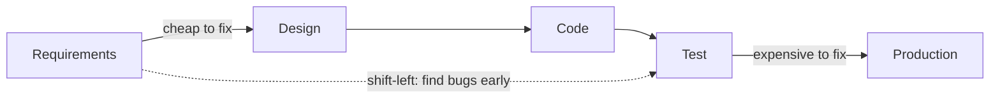

**Core testing principles (the classic seven, worth knowing):**

1. **Testing shows the presence of defects, not their absence** — you can never prove software is bug-free, only find bugs.
2. **Exhaustive testing is impossible** — you can't test every input/path; use risk and prioritization (§5).
3. **Early testing** saves time and money (shift-left).
4. **Defect clustering** — a small number of modules usually contain most defects (Pareto).
5. **The pesticide paradox** — the same tests stop finding new bugs; evolve them.
6. **Testing is context-dependent** — a banking app is tested differently from a game.
7. **Absence-of-errors fallacy** — bug-free software that doesn't meet user needs is still a failure.

**Key terms** (used precisely in the industry):

- **Error** (human mistake) → **Defect/Bug** (flaw in the code) → **Failure** (the system behaving wrong in operation). An error *causes* a defect, which *may cause* a failure.
- **Test case** — a set of inputs, preconditions, steps, and expected results.
- **Test suite** — a collection of test cases.
- **Assertion** — a check that an actual result matches the expected result (the heart of an automated test).

🔑 **Takeaway:** testing builds **confidence that software meets requirements** (verification) **and user needs** (validation). Bugs get **exponentially more expensive** the later they're found, so **test early (shift-left)**. Internalize the **seven principles** — especially "testing shows presence not absence of defects" and "exhaustive testing is impossible" — and the **error → defect → failure** vocabulary.

---

## 2. Testing Types: Functional & Non-Functional

Tests split into two broad families: **functional** (does it do the right thing?) and **non-functional** (how well does it do it?).

**Functional testing** — verifies features against requirements (behavior/output):

- **Smoke testing** — a quick "does the build even work?" check of critical paths before deeper testing. (a.k.a. build verification.)
- **Sanity testing** — a narrow check that a specific fix/feature works after a change.
- **Regression testing** — re-running tests to ensure new changes didn't break existing functionality. *The* biggest driver of automation (you re-run it constantly).
- **Re-testing (confirmation)** — verifying a specific reported defect is fixed.
- **Integration testing** — verifying modules work together (§3).
- **System testing** — testing the complete, integrated system end-to-end against requirements.
- **User Acceptance Testing (UAT)** — end users/business validate it meets their needs before go-live.
- **Exploratory testing** — simultaneous learning, test design, and execution by a skilled tester (unscripted, high-value for finding surprising bugs).

**Non-functional testing** — verifies qualities/attributes:

| Type | Verifies |
|---|---|
| **Performance** (load, stress, spike, soak/endurance, scalability) | Speed, throughput, stability under load (§24) |
| **Security** | Protection against threats/vulnerabilities (§25) |
| **Usability** | Ease of use / UX |
| **Accessibility** | Usable by people with disabilities (WCAG) (§25) |
| **Compatibility** | Works across browsers, OSes, devices, versions |
| **Reliability** | Consistent operation over time |
| **Compliance** | Meets standards/regulations (huge in banking 🏦, §32) |
| **Localization/Internationalization** | Language/region correctness |

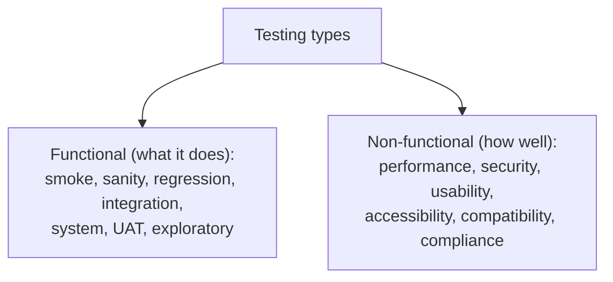

**Other important distinctions:**

- **Black-box** (test via inputs/outputs, no code knowledge — most functional testing) vs **white-box** (test with knowledge of internal code/paths — unit testing, coverage) vs **grey-box** (a mix).
- **Positive testing** (valid input → expected success) vs **negative testing** (invalid input → graceful failure). Negative testing catches the bugs users actually hit; don't only test the happy path.
- **Static testing** (reviews, static analysis — no execution) vs **dynamic testing** (running the code).

🔑 **Takeaway:** **functional** testing checks *what* the software does (smoke → sanity → regression → integration → system → UAT, plus exploratory); **non-functional** checks *how well* (performance, security, usability, accessibility, compatibility, compliance). Also know **black/white/grey-box**, **positive vs negative** (always test negative paths), and **static vs dynamic**. **Regression testing** is the main reason automation exists.

---

## 3. Testing Levels & the Test Pyramid

Tests exist at different **levels** of granularity, and the **balance** between them is one of the most important strategic decisions in test automation.

**The four levels (bottom-up):**

1. **Unit testing** — tests a single function/class/module in isolation, usually by developers, with dependencies mocked/stubbed. Fast, precise, cheap. (JUnit/TestNG/pytest, guides `17`/`03`.)
2. **Integration testing** — tests that modules/services work together (e.g. code + database, service + API). Catches wiring/contract bugs units miss.
3. **System / end-to-end (E2E) testing** — tests the whole application through its real interface (usually the UI or public API), simulating a user journey. This is where Selenium/Playwright live.
4. **Acceptance testing (UAT)** — validates business requirements, often by users/business analysts.

**The Test Pyramid** — the canonical guidance for *how many* of each: **many fast unit tests at the base, fewer integration tests in the middle, and a thin layer of slow E2E tests at the top.**

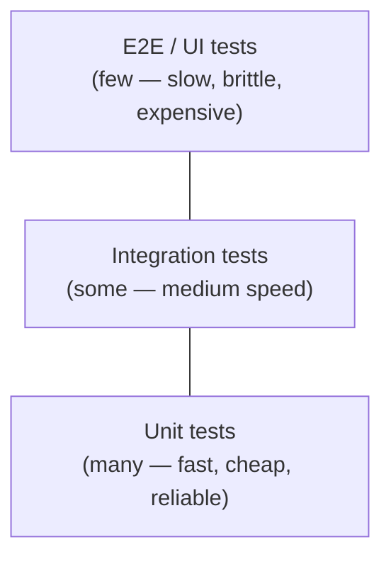

**Why the pyramid shape:** as you go up, tests get **slower, more brittle (flaky), and more expensive to write/maintain**, and failures are **harder to diagnose** (an E2E failure could be anywhere). So you push testing **down** to the cheapest level that can catch a given class of bug. Test logic in units; test wiring in integration; reserve E2E for a **small set of critical user journeys**.

⚠️ **The "ice-cream cone" anti-pattern** — a suite dominated by slow, flaky UI/E2E tests with few unit tests (the pyramid inverted). It's slow, unreliable, and painful to maintain — a very common real-world failure. **The most valuable thing many teams can do is push tests down the pyramid.**

**A modern nuance — the "testing trophy":** for some app types (esp. front-end/JS), **integration tests** deliver the best confidence-per-cost, so the trophy shape emphasizes them over pure units. The principle is the same: **favor the cheapest, most reliable level that gives real confidence, and keep slow E2E thin.**

🔑 **Takeaway:** tests come in **levels** — **unit → integration → system/E2E → acceptance** — with each higher level **slower, flakier, and pricier**. Follow the **test pyramid**: **lots of unit tests, some integration, few E2E**. Avoid the **ice-cream cone** (all UI tests). Reserve UI automation (Selenium/Playwright) for **critical journeys**, and catch everything else lower down.

---

## 4. SDLC, STLC & Testing Methodologies

Testing doesn't happen in a vacuum — it's woven through the development process.

**SDLC (Software Development Life Cycle)** — the overall process of building software: requirements → design → development → testing → deployment → maintenance. **STLC (Software Testing Life Cycle)** is the testing-specific sub-process:

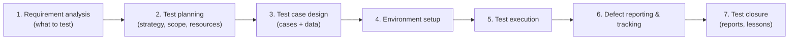

- **Test planning** produces a **test plan** (scope, approach, resources, schedule, entry/exit criteria).
- **Entry/exit criteria** — conditions to start/stop a test phase (e.g. exit: 100% critical tests pass, no open Sev-1 defects).
- **Defect life cycle:** New → Assigned → Open → Fixed → Retest → Closed (or Reopened/Rejected/Deferred). Know defect **severity** (impact) vs **priority** (urgency to fix) — a typo on a landing page might be low severity but high priority; a rare crash might be high severity, lower priority.

**Development methodologies and where testing fits:**

- **Waterfall** — sequential phases; testing is a distinct phase *after* development. Rigid; late defect discovery.
- **Agile** — iterative sprints; testing is **continuous and embedded** in each sprint (testers work alongside devs). The dominant model.
- **DevOps / CI-CD** — testing is **automated and continuous** in the pipeline (guide `26`); every commit is tested.

**Testing-centric approaches:**

- **TDD (Test-Driven Development)** — write a failing test *first*, then code to pass it, then refactor (red-green-refactor). Drives design and guarantees coverage of new code.
- **BDD (Behavior-Driven Development)** — express behavior in plain-language scenarios (Given-When-Then, Gherkin) shared with non-technical stakeholders; automated via Cucumber/Behave (§27).
- **Shift-left testing** — test earlier (unit, static analysis, reviews) to catch defects sooner (§1).
- **Shift-right testing** — test in production (monitoring, canary releases, chaos, A/B) — complements shift-left (ties to observability, guide `30`).

🔑 **Takeaway:** the **STLC** (analysis → planning → design → setup → execution → defect tracking → closure) runs within the **SDLC**. Know **entry/exit criteria**, the **defect life cycle**, and **severity vs priority**. Modern testing is **Agile + CI/CD continuous**, driven by **TDD/BDD**, and spans **shift-left** (test early) to **shift-right** (test in prod).

---

## 5. Test Design Techniques (Cases, Coverage, Data)

Since exhaustive testing is impossible (§1), **test design techniques** help you pick a *small, high-value* set of test cases that maximize defect-finding. This is a core skill — and a frequent interview topic.

**Black-box techniques (design from requirements, no code):**

- **Equivalence Partitioning (EP)** — divide inputs into groups (partitions) that should behave the same, and test **one representative per partition** (plus invalid partitions). E.g. an age field 18–60: test one valid (30), one below (10), one above (70) — not every number.
- **Boundary Value Analysis (BVA)** — bugs cluster at boundaries, so test **at and around the edges**. For 18–60: test 17, 18, 19 and 59, 60, 61. Combine with EP.
- **Decision Table Testing** — for combinations of conditions → actions; enumerate rules in a table (great for business logic like loan eligibility 🏦).
- **State Transition Testing** — model states and transitions (e.g. an order: Pending → Paid → Shipped); test valid and invalid transitions.
- **Pairwise / combinatorial testing** — when many parameters combine explosively, test all *pairs* of values (catches most interaction bugs with far fewer cases).
- **Error guessing** — experience-based guessing of likely failure points (empty input, zero, negatives, huge values, special characters).

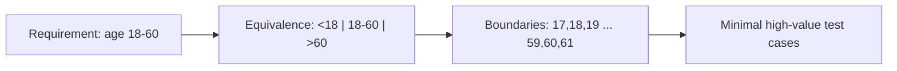

**White-box techniques (design from code):**

- **Statement coverage** — every line executed at least once.
- **Branch/decision coverage** — every branch (if/else) taken.
- **Path coverage** — every path through the code (strongest, often impractical).
- ⚠️ **Coverage is a guide, not a goal.** 100% line coverage doesn't mean bug-free (you can execute a line without asserting its correctness). Chase *meaningful* coverage of important logic, not a vanity number.

**Test data & good test cases:**

- A good **test case** has: a clear ID/title, preconditions, steps, **test data**, expected result, and is **atomic, independent, and repeatable**.
- **Test data management** — realistic, varied data covering valid/invalid/boundary/edge cases; keep it **isolated and reproducible** (don't depend on shared mutable data — a top cause of flakiness, §31). 🔒 Never use real customer/PII data in test environments (mask/synthesize it — critical in banking, §32).

🔑 **Takeaway:** design a **small, high-value** test set with black-box techniques — **equivalence partitioning + boundary value analysis** (the everyday pair), plus **decision tables**, **state transition**, **pairwise**, and **error guessing** — and use **coverage** (statement/branch/path) as a *guide*, not a target. Write **atomic, independent, repeatable** cases with well-managed, **masked** test data.

---

## 6. Manual vs Automated Testing: What to Automate

Automation is powerful but not universal. Knowing **what** to automate (and what not to) is what separates effective test engineers from those who automate everything and drown in maintenance.

**Manual testing** — a human executes tests. Best for:

- **Exploratory testing** (creative, unscripted bug-hunting).
- **Usability/UX** (does it *feel* right?).
- **Ad-hoc / one-off** checks.
- **Early/unstable features** where the UI changes constantly (automating too early = constant rework).

**Automated testing** — scripts execute tests. Best for:

- **Regression** (run the same checks repeatedly — the #1 automation use case).
- **Repetitive, stable** flows.
- **Data-driven** tests (same flow, many datasets).
- **Performance/load** (impossible manually).
- **Cross-browser/platform** at scale.
- Anything in **CI/CD** that must run on every commit.

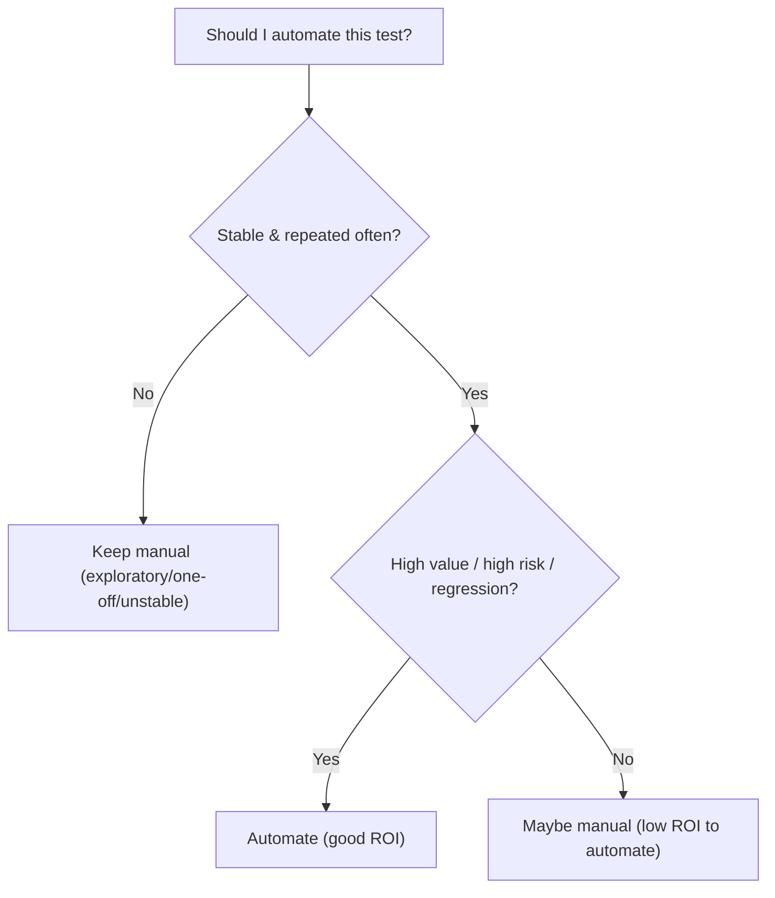

**The ROI lens — automate when the payoff beats the cost.** Automation has real upfront + maintenance cost. It pays off when a test is **run many times** (regression), is **stable** (won't need constant rewrites), and is **valuable/high-risk**. Automating a rarely-run test of a volatile feature is usually a net loss.

**Good automation candidates (a checklist):** stable UI/flow · run frequently · deterministic · high business risk (login, checkout, payments 🏦) · tedious/error-prone manually · needs many data variations · needs cross-browser coverage.

**Poor candidates:** constantly-changing UI · run once · subjective (look/feel) · needs human judgment · extremely complex setup for little payoff.

⚠️ **"Automate everything" is a trap.** It produces huge, slow, flaky suites nobody trusts. Automate strategically at the right level (pyramid, §3): most automation should be *below* the UI (unit/API), with a thin, high-value UI/E2E layer.

🔑 **Takeaway:** **manual** testing wins for **exploratory, usability, ad-hoc, and unstable** features; **automation** wins for **regression, repetitive, data-driven, performance, and cross-platform** testing — decided by **ROI** (run-often × stable × high-value beats the maintenance cost). Don't "automate everything"; automate **strategically at the right level**, favoring below-the-UI tests.

---

# Part II — Selenium (Java & Python)

## 7. Selenium Architecture & WebDriver (incl. BiDi)

**Selenium** is the long-standing, open-source suite for browser automation — the industry standard for web UI testing, with bindings in **Java, Python, C#, Ruby, JavaScript** and support for all major browsers. The modern era is **Selenium 4.x** (4.48 as of 2026-08-28).

**The components:**

- **Selenium WebDriver** — the core: a programming interface to drive a real browser (click, type, navigate, read the DOM). This is what "Selenium" usually means today.
- **Selenium Grid** — run tests on remote machines / in parallel across browsers and OSes (§13).
- **Selenium IDE** — a record-and-playback browser extension (for quick prototyping/learning; not for serious suites).

**How WebDriver works (the architecture):** your test code calls the WebDriver API in your language binding → the binding sends commands to a **browser driver** (ChromeDriver, GeckoDriver for Firefox, etc.) → the driver controls the actual browser and returns results.

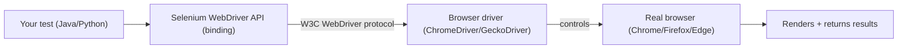

**What changed in Selenium 4 (important for "latest version" awareness):**

- **W3C WebDriver protocol standard** — Selenium 4 fully aligned with the W3C standard (Selenium 3 used the older JSON Wire Protocol), improving cross-browser consistency.
- **Selenium Manager** — automatically downloads and manages the correct **browser drivers** for you. ⚠️ This means you **no longer need to manually download ChromeDriver or set `webdriver.chrome.driver`** (or use WebDriverManager) in most cases — a big quality-of-life change from Selenium 3.
- **Relative locators** — find elements relative to others (`above`, `below`, `toLeftOf`, `near`).
- **WebDriver BiDi (bidirectional protocol)** — the major forward-looking change. Classic WebDriver is request/response (you ask, it answers); **BiDi** is a bidirectional protocol enabling the browser to *push* events to your test (network interception, console logs, JS exceptions, auth, DOM mutations). It supersedes the Chrome-only **CDP (Chrome DevTools Protocol)** as the **standard cross-browser** low-level protocol — and in 2026 Firefox blocks CDP, cementing BiDi as the future. Selenium 4.4x+ ships expanding BiDi network/script/emulation APIs across Java/Python/.NET.

🔑 **Takeaway:** **Selenium = WebDriver (drive real browsers via a driver) + Grid (distributed/parallel) + IDE (record-playback)**, in many languages. **Selenium 4** aligned with the **W3C standard**, added **Selenium Manager** (auto driver management — no more manual ChromeDriver), **relative locators**, and — the big one — **WebDriver BiDi**, the bidirectional, cross-browser protocol that supersedes CDP for network interception, logs, and events.

---

## 8. Selenium Setup: Java & Python

Modern setup is simpler than the Selenium 3 days thanks to **Selenium Manager** (drivers are auto-resolved).

**Java (Maven + JUnit 5):**

```xml
<!-- pom.xml -->
<dependencies>
  <dependency>
    <groupId>org.seleniumhq.selenium</groupId>
    <artifactId>selenium-java</artifactId>
    <version>4.48.0</version>
  </dependency>
  <dependency>
    <groupId>org.junit.jupiter</groupId>
    <artifactId>junit-jupiter</artifactId>
    <version>5.11.0</version>
    <scope>test</scope>
  </dependency>
</dependencies>
```

```java
// FirstTest.java
import org.junit.jupiter.api.*;
import org.openqa.selenium.*;
import org.openqa.selenium.chrome.ChromeDriver;
import static org.junit.jupiter.api.Assertions.*;

class FirstTest {
    WebDriver driver;

    @BeforeEach void setUp() {
        driver = new ChromeDriver();   // Selenium Manager auto-provides the driver — no path needed
    }

    @Test void hasCorrectTitle() {
        driver.get("https://example.com");
        assertEquals("Example Domain", driver.getTitle());
    }

    @AfterEach void tearDown() {
        if (driver != null) driver.quit();   // ALWAYS quit — frees the browser process
    }
}
```

**Python (pip + pytest):**

```bash
pip install selenium pytest
```

```python
# test_first.py
import pytest
from selenium import webdriver
from selenium.webdriver.common.by import By

@pytest.fixture
def driver():
    drv = webdriver.Chrome()      # Selenium Manager auto-provides the driver
    yield drv
    drv.quit()                    # teardown: always quit

def test_has_correct_title(driver):
    driver.get("https://example.com")
    assert driver.title == "Example Domain"
```

**Key setup concepts:**

- **`driver.quit()` vs `driver.close()`** — `quit()` closes **all** windows and ends the WebDriver session (use in teardown); `close()` closes only the **current** window. ⚠️ Not calling `quit()` leaks browser processes — a common resource bug in CI.
- **Browser options** — headless mode (no visible UI, faster in CI), window size, arguments:

```java
ChromeOptions options = new ChromeOptions();
options.addArguments("--headless=new", "--window-size=1920,1080", "--no-sandbox");
WebDriver driver = new ChromeDriver(options);
```

```python
from selenium.webdriver.chrome.options import Options
opts = Options(); opts.add_argument("--headless=new"); opts.add_argument("--window-size=1920,1080")
driver = webdriver.Chrome(options=opts)
```

- **Cross-browser:** swap `ChromeDriver`/`webdriver.Chrome()` for `FirefoxDriver`/`webdriver.Firefox()`, `EdgeDriver`, etc. — same API.

💡 **Pro tip:** run **headless in CI** (faster, no display needed) but **headed locally** while debugging. And centralize driver creation in a factory/fixture (§34) so options and browser choice are configured in one place.

🔑 **Takeaway:** with **Selenium 4 + Selenium Manager**, setup is `new ChromeDriver()` / `webdriver.Chrome()` — **no manual driver download**. Add **JUnit 5/TestNG** (Java) or **pytest** (Python) as the runner, use **`@BeforeEach`/fixtures** for setup and **always `driver.quit()`** in teardown, configure **`ChromeOptions`** (headless in CI), and swap the driver class for cross-browser.

---

## 9. Locators & Finding Elements

To interact with a page, you first **locate** elements. Choosing robust locators is *the* skill that determines whether your tests are stable or flaky.

**The locator strategies (`By` in Java, `By` in Python):**

| Strategy | Java | Python | Notes |
|---|---|---|---|
| **ID** | `By.id("x")` | `By.ID, "x"` | Best — fast, unique (if present) |
| **Name** | `By.name("x")` | `By.NAME` | Good |
| **CSS selector** | `By.cssSelector(".c > a")` | `By.CSS_SELECTOR` | Fast, flexible — preferred general choice |
| **XPath** | `By.xpath("//div[@id='x']")` | `By.XPATH` | Most powerful (traverse up/down, text) but slower/brittle |
| **Class name** | `By.className("btn")` | `By.CLASS_NAME` | Single class only |
| **Link text / partial** | `By.linkText("Home")` | `By.LINK_TEXT` | For `<a>` links |
| **Tag name** | `By.tagName("input")` | `By.TAG_NAME` | Rarely alone |

```java
WebElement el = driver.findElement(By.id("username"));           // one element (throws if none)
List<WebElement> items = driver.findElements(By.cssSelector(".item"));  // list (empty if none)
```

```python
el = driver.find_element(By.ID, "username")
items = driver.find_elements(By.CSS_SELECTOR, ".item")
```

- ⚠️ **`findElement` throws `NoSuchElementException`** if nothing matches; **`findElements` returns an empty list** (never throws) — use the plural to check existence.

**CSS vs XPath (the classic debate):**

- **CSS selectors** — faster, cleaner, natively supported by browsers. Preferred for most cases. Can't traverse *up* the DOM or select by visible text.
- **XPath** — more powerful: traverse **up** (`..`, `ancestor::`), select by **text** (`//button[text()='Submit']`), and complex conditions. But slower and often more brittle. Use when CSS can't express it.

**Choosing robust locators (the #1 anti-flakiness lever):**

1. **Prefer stable, semantic attributes** — a dedicated test attribute like **`data-testid`** is the gold standard (won't change with styling): `By.cssSelector("[data-testid='login-btn']")`.
2. **Then `id`/`name`** if stable.
3. **Avoid** brittle locators: auto-generated classes (`css-1x2y3z`), deep positional XPath (`/html/body/div[3]/div[2]/span`), and text that changes with locale/copy.

**Selenium 4 relative locators** — find elements by spatial relationship:

```java
import static org.openqa.selenium.support.locators.RelativeLocator.with;
WebElement password = driver.findElement(with(By.tagName("input")).below(By.id("username")));
```

💡 **Pro tip:** collaborate with developers to add **`data-testid`** attributes to key elements. It's the single biggest improvement you can make to UI-test stability — locators stop breaking when CSS/markup is refactored.

🔑 **Takeaway:** locate elements with `By` strategies — prefer **`data-testid` / stable `id`**, then **CSS selectors** (fast, clean), and reserve **XPath** for what CSS can't do (up-traversal, text match). Use **`findElements`** (plural) to check existence without exceptions. **Robust locators are the foundation of non-flaky UI tests** — avoid auto-generated classes and positional XPath.

---

## 10. Interacting with Elements & Browser

Once located, you interact with elements and control the browser.

**Element interactions:**

```java
WebElement input = driver.findElement(By.id("email"));
input.sendKeys("user@example.com");   // type
input.clear();                        // clear a field
driver.findElement(By.id("submit")).click();   // click

// Read state
String text = el.getText();                 // visible text
String value = el.getAttribute("value");    // attribute
boolean shown = el.isDisplayed();           // visible?
boolean on = el.isEnabled();                // enabled?
boolean sel = el.isSelected();              // checkbox/radio selected?
```

```python
inp = driver.find_element(By.ID, "email")
inp.send_keys("user@example.com")
inp.clear()
driver.find_element(By.ID, "submit").click()
text = el.text
value = el.get_attribute("value")
```

**Dropdowns** (`<select>`) use the `Select` helper:

```java
import org.openqa.selenium.support.ui.Select;
Select country = new Select(driver.findElement(By.id("country")));
country.selectByVisibleText("India");
country.selectByValue("IN");
country.selectByIndex(2);
```

```python
from selenium.webdriver.support.ui import Select
Select(driver.find_element(By.ID, "country")).select_by_visible_text("India")
```

**Browser & navigation:**

```java
driver.get("https://site.com");            // navigate (waits for load)
driver.navigate().to("https://other.com");
driver.navigate().back();
driver.navigate().forward();
driver.navigate().refresh();
String url = driver.getCurrentUrl();
String title = driver.getTitle();
driver.manage().window().maximize();
```

**Screenshots** (essential for debugging failures — capture on failure, §29):

```java
File src = ((TakesScreenshot) driver).getScreenshotAs(OutputType.FILE);
```

```python
driver.save_screenshot("failure.png")
el.screenshot("element.png")   # element-level (Selenium 4)
```

⚠️ **Common interaction failures:** `ElementNotInteractableException` (element not visible/enabled yet → wait, §11), `ElementClickInterceptedException` (something overlays it, e.g. a cookie banner or sticky header → dismiss it or scroll), and `StaleElementReferenceException` (the DOM changed after you located the element → re-find it). These are the everyday exceptions; recognizing them speeds debugging enormously.

🔑 **Takeaway:** interact via `sendKeys`/`clear`/`click`, read state with `getText`/`getAttribute`/`isDisplayed`/`isEnabled`/`isSelected`, handle `<select>` with the **`Select`** helper, and navigate with `get`/`navigate()`. Capture **screenshots on failure**. Know the everyday exceptions — **NotInteractable, ClickIntercepted, StaleElement** — and their fixes (wait, dismiss overlay, re-find).

---

## 11. Waits: Implicit, Explicit & Fluent

**Waits are the #1 topic in Selenium** because the #1 cause of flaky UI tests is **timing** — the test acts before the page/element is ready. Modern web apps load asynchronously (AJAX, SPAs), so you must synchronize your test with the app's state. ⚠️ Unlike Playwright, **Selenium does not auto-wait** — you must handle waits explicitly.

**Three wait types:**

**1. Implicit wait** — a global setting: for *every* `findElement`, poll for up to N seconds before throwing `NoSuchElementException`.

```java
driver.manage().timeouts().implicitlyWait(Duration.ofSeconds(10));
```
```python
driver.implicitly_wait(10)
```
- ✅ Simple, set once. ❌ Applies only to element *presence* (not clickability/visibility/text), and can *slow down* negative tests. ⚠️ **Don't mix implicit and explicit waits** — the combination causes unpredictable, longer-than-expected waits.

**2. Explicit wait (preferred)** — wait for a *specific condition* on a specific element:

```java
import org.openqa.selenium.support.ui.WebDriverWait;
import org.openqa.selenium.support.ui.ExpectedConditions;

WebDriverWait wait = new WebDriverWait(driver, Duration.ofSeconds(10));
WebElement btn = wait.until(ExpectedConditions.elementToBeClickable(By.id("submit")));
btn.click();
wait.until(ExpectedConditions.visibilityOfElementLocated(By.id("result")));
wait.until(ExpectedConditions.textToBePresentInElementLocated(By.id("status"), "Done"));
```

```python
from selenium.webdriver.support.ui import WebDriverWait
from selenium.webdriver.support import expected_conditions as EC

wait = WebDriverWait(driver, 10)
btn = wait.until(EC.element_to_be_clickable((By.ID, "submit")))
btn.click()
wait.until(EC.visibility_of_element_located((By.ID, "result")))
```

Common **ExpectedConditions**: `visibilityOfElementLocated`, `elementToBeClickable`, `presenceOfElementLocated`, `textToBePresentInElement`, `titleIs`, `invisibilityOfElementLocated`, `alertIsPresent`.

**3. Fluent wait** — an explicit wait with custom polling interval and ignored exceptions:

```java
Wait<WebDriver> fluent = new FluentWait<>(driver)
    .withTimeout(Duration.ofSeconds(15))
    .pollingEvery(Duration.ofMillis(500))
    .ignoring(NoSuchElementException.class);
```

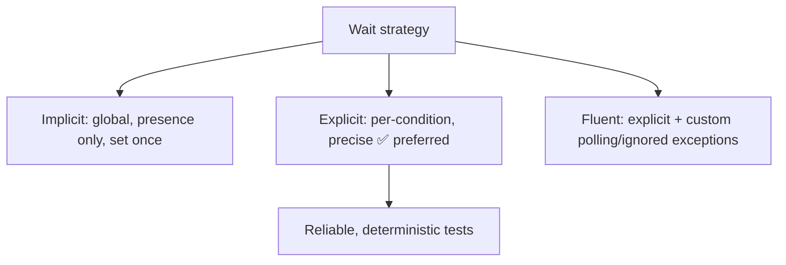

⚠️ **NEVER use `Thread.sleep()` / `time.sleep()` for synchronization.** A hard sleep is either too short (flaky) or too long (slow) and is never right. Use explicit waits — they return **as soon as** the condition is met. `sleep` in test code is a red flag in review.

🔑 **Takeaway:** Selenium **doesn't auto-wait**, so **synchronization is your job** and the top source of flakiness. Prefer **explicit waits** (`WebDriverWait` + `ExpectedConditions` for the exact condition — clickable, visible, text present); use **implicit wait** sparingly (and **never mix** it with explicit); use **fluent wait** for custom polling. **Never use `Thread.sleep`/`time.sleep`** — it's the classic flaky/slow anti-pattern.

---

## 12. Advanced Selenium: Frames, Windows, Actions, JS

Real apps have iframes, popups, complex gestures, and edge cases the basic API doesn't cover.

**iframes** — you must **switch into** a frame before interacting with elements inside it, then switch back:

```java
driver.switchTo().frame("frameNameOrId");        // or by index / WebElement
driver.findElement(By.id("inside")).click();
driver.switchTo().defaultContent();              // back to the main page
```
⚠️ A very common bug: trying to find an element that's inside an iframe without switching → `NoSuchElementException`. Payment forms (🏦) often embed card fields in an iframe (e.g. Stripe Elements, guide `09`).

**Windows/tabs** — switch by window handle:

```java
String original = driver.getWindowHandle();
for (String handle : driver.getWindowHandles()) {
    if (!handle.equals(original)) driver.switchTo().window(handle);
}
// ... work in new tab ...
driver.close();                        // close the new tab
driver.switchTo().window(original);    // back to original
```

**Alerts / JS dialogs:**

```java
Alert alert = driver.switchTo().alert();
alert.accept();      // OK
alert.dismiss();     // Cancel
alert.sendKeys("text");
String msg = alert.getText();
```

**Actions API** — complex interactions (hover, drag-drop, right-click, key combos):

```java
import org.openqa.selenium.interactions.Actions;
Actions actions = new Actions(driver);
actions.moveToElement(menu).perform();                    // hover
actions.dragAndDrop(source, target).perform();            // drag & drop
actions.contextClick(el).perform();                       // right-click
actions.keyDown(Keys.CONTROL).sendKeys("a").keyUp(Keys.CONTROL).perform();  // Ctrl+A
```

**JavaScript executor** — run JS directly (escape hatch for things WebDriver can't do — scrolling, clicking hidden elements, reading JS state):

```java
JavascriptExecutor js = (JavascriptExecutor) driver;
js.executeScript("arguments[0].scrollIntoView(true);", element);
js.executeScript("arguments[0].click();", element);   // click even if intercepted
Long height = (Long) js.executeScript("return document.body.scrollHeight");
```
⚠️ Use the JS executor **sparingly** — a JS click bypasses real user interaction (and thus doesn't test what a user experiences). Prefer real clicks; use JS only when genuinely necessary.

**File uploads** — send the file path to the `<input type="file">` (no OS dialog needed):

```java
driver.findElement(By.id("upload")).sendKeys("/path/to/file.pdf");
```

**WebDriver BiDi (Selenium 4.4x+)** — for network interception, console logs, and JS exceptions, use the new BiDi APIs (superseding CDP; §7). Example: capturing console logs or mocking a network response for a test — increasingly the standard way to do these cross-browser.

🔑 **Takeaway:** switch context for **iframes** (`switchTo().frame`/`defaultContent` — forgetting this is a classic bug) and **windows/tabs** (window handles); handle **alerts** via `switchTo().alert()`; use the **Actions API** for hover/drag/right-click/key-combos; use the **JavaScriptExecutor** sparingly (scroll/read-state, not to fake clicks); upload files by `sendKeys` to the file input; and reach for **BiDi** for network/logs/events.

---

## 13. Selenium Grid & Parallel Execution

Running tests one browser at a time on your laptop doesn't scale. **Selenium Grid** distributes tests across multiple machines/browsers and runs them **in parallel**, drastically cutting suite time and enabling cross-browser coverage.

**Grid 4 architecture** (redesigned in Selenium 4):

- **Router** — entry point; routes requests to the right node.
- **Distributor** — assigns sessions to nodes with matching capabilities.
- **Session Map** — tracks which session is on which node.
- **Nodes** — machines running the actual browsers.
- Can run as **Standalone** (all-in-one, simplest), **Hub-and-Node** (classic), or **fully distributed** (each component separate, for scale/HA).

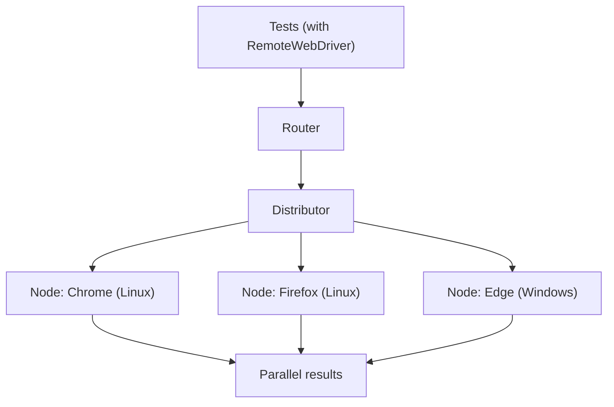

**Connecting to Grid** — use `RemoteWebDriver` pointing at the Grid URL instead of a local driver:

```java
ChromeOptions options = new ChromeOptions();
WebDriver driver = new RemoteWebDriver(new URL("http://grid-host:4444"), options);
```
```python
from selenium import webdriver
driver = webdriver.Remote(command_executor="http://grid-host:4444",
                          options=webdriver.ChromeOptions())
```

**Running Grid** — the easiest modern approach is **Docker** (guide `25`); official `selenium/*` images spin up a hub + browser nodes (or use `docker-compose`). Grid also runs on **Kubernetes** for elastic scale (Selenium 4.4x improved dynamic-grid video storage per session on K8s).

**Parallel execution in your framework** (Grid runs them; your runner *dispatches* them in parallel):

- **TestNG** — `parallel="methods|classes|tests"` and `thread-count` in `testng.xml`.
- **JUnit 5** — parallel execution via `junit-platform.properties`.
- **pytest** — the **`pytest-xdist`** plugin: `pytest -n 4` runs across 4 workers.

⚠️ **Parallel-safe tests are mandatory for this to work.** Tests must be **independent** (no shared mutable state, no order dependence) and **thread-safe** (in Java, a common pattern is a **ThreadLocal<WebDriver>** so each thread gets its own driver instance). Parallelizing coupled tests causes chaos — this is a top interview and real-world topic.

**Cloud grids** — instead of self-hosting, services like **BrowserStack, Sauce Labs, LambdaTest** provide on-demand grids with hundreds of browser/OS/device combinations (great for cross-browser/real-device coverage without infra).

🔑 **Takeaway:** **Selenium Grid** distributes tests across machines/browsers for **parallel, cross-browser** runs — connect via **`RemoteWebDriver`**, run it easily with **Docker** (or K8s for scale). Dispatch parallelism from your runner (**TestNG**, **JUnit 5**, **pytest-xdist**). Tests **must be independent and thread-safe** (e.g. **ThreadLocal driver**) to parallelize. Use **cloud grids** (BrowserStack/Sauce/LambdaTest) to avoid managing infra.

---

# Part III — Playwright (Java & Python)

## 14. Playwright Architecture & Why It's Different

**Playwright** (from Microsoft, first released 2020) is the modern browser-automation framework that's become the default choice for new web test suites in 2026. It supports **Chromium, Firefox, and WebKit** (Safari's engine) with a single API, and official bindings for **JavaScript/TypeScript, Python, Java, and .NET**.

**Why it's architecturally different from Selenium (this is the whole point):**

- **Direct browser control via a persistent connection.** Selenium talks to a browser *driver* over HTTP request/response per command. Playwright drives browsers over a **single WebSocket connection** using the browsers' own automation protocols (CDP for Chromium, etc.), which is faster and enables event-based features.
- **Auto-waiting (the killer feature).** Before every action, Playwright **automatically waits** for the element to be **actionable** (attached, visible, stable, enabled, receiving events). This **eliminates most explicit waits and most flakiness** — you rarely write `wait` code. (Contrast Selenium §11, where waits are your job.)
- **Bundled browsers.** `playwright install` downloads consistent, pinned browser binaries — no version-mismatch between browser and driver, reproducible across machines/CI.
- **Web-first assertions** with auto-retry (§16), **network interception** built in, **tracing** (a time-travel debugger), **codegen** (record actions to code), and **browser contexts** for cheap, isolated parallel sessions.

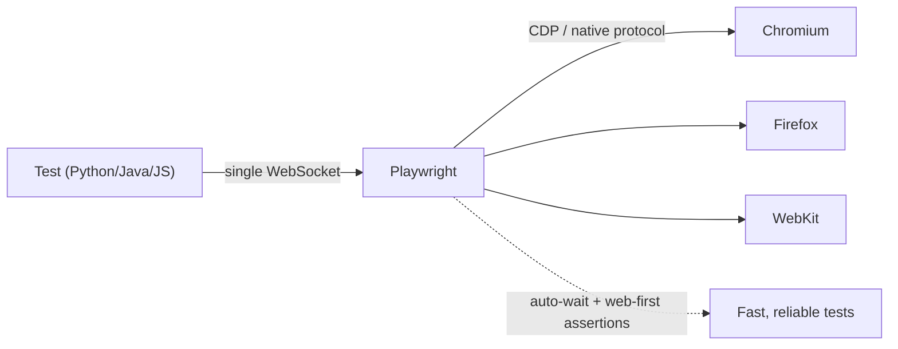

**Key concepts / object model:**

- **Browser** — a browser instance (Chromium/Firefox/WebKit).
- **BrowserContext** — an **isolated session** within a browser (own cookies, storage, cache) — like a fresh incognito profile. Cheap to create → run many in parallel; perfect isolation between tests.
- **Page** — a tab within a context; where you do most actions.
- **Locator** — a *lazy*, auto-retrying reference to element(s) (§16) — resolved at action time, so it's robust to DOM changes.

⚠️ **Trade-offs vs Selenium:** Playwright supports fewer *languages* (4 vs Selenium's more) and its browsers are its bundled builds (great for consistency, but it drives Chromium/Firefox/WebKit — not, say, real Safari or old IE the way a Selenium grid might). For most modern web testing these are non-issues; for maximum browser/language breadth or legacy, Selenium still wins (§33).

🔑 **Takeaway:** **Playwright** drives Chromium/Firefox/WebKit over a **fast persistent connection** with **built-in auto-waiting** (eliminating most flakiness and explicit waits), **bundled browsers** (reproducible), **tracing/codegen/network interception**, and cheap isolated **browser contexts** for parallelism. Its object model is **Browser → BrowserContext (isolated) → Page → Locator (lazy, auto-retrying)**. It's the **modern default**; Selenium wins on raw language/browser breadth.

---

## 15. Playwright Setup: Python & Java

**Python (with pytest — the most popular Playwright+Python setup):**

```bash
pip install pytest-playwright
playwright install           # downloads Chromium, Firefox, WebKit binaries
```

```python
# test_example.py  (pytest-playwright provides the `page` fixture automatically)
from playwright.sync_api import Page, expect

def test_has_title(page: Page):
    page.goto("https://example.com")
    expect(page).to_have_title("Example Domain")   # web-first assertion (auto-retries)

def test_login(page: Page):
    page.goto("https://example.com/login")
    page.get_by_label("Email").fill("user@example.com")
    page.get_by_label("Password").fill("secret")
    page.get_by_role("button", name="Log in").click()
    expect(page.get_by_text("Welcome")).to_be_visible()
```

```bash
pytest                              # run
pytest --headed                     # see the browser
pytest --browser firefox --browser webkit   # cross-browser
pytest -n 4                         # parallel (with pytest-xdist)
```

Playwright Python also has an **async API** (`playwright.async_api`) for asyncio codebases; the sync API above is simplest for tests.

**Java (Maven + JUnit 5):**

```xml
<dependency>
  <groupId>com.microsoft.playwright</groupId>
  <artifactId>playwright</artifactId>
  <version>1.49.0</version>
</dependency>
```

```java
import com.microsoft.playwright.*;
import org.junit.jupiter.api.*;
import static com.microsoft.playwright.assertions.PlaywrightAssertions.assertThat;

class ExampleTest {
    static Playwright playwright;
    static Browser browser;
    BrowserContext context;
    Page page;

    @BeforeAll static void launch() {
        playwright = Playwright.create();
        browser = playwright.chromium().launch();   // .setHeadless(false) to watch
    }
    @AfterAll static void close() { browser.close(); playwright.close(); }

    @BeforeEach void newContext() { context = browser.newContext(); page = context.newPage(); }
    @AfterEach void closeContext() { context.close(); }   // isolate each test

    @Test void hasTitle() {
        page.navigate("https://example.com");
        assertThat(page).hasTitle("Example Domain");   // web-first assertion
    }
}
```

(First run of the Java binding auto-downloads browsers; you can also run `mvn exec` with the install option.)

**JS/TS** (for reference — the most feature-rich binding) uses `@playwright/test`, its own test runner with config, fixtures, and projects.

💡 **Pro tip:** in Python, use **`pytest-playwright`** (gives you `page`, `browser`, `context` fixtures, `--headed`, `--browser`, screenshots/traces-on-failure flags for free). In Java, create a **fresh `BrowserContext` per test** for isolation while reusing one `Browser` (cheap contexts, expensive browser launch).

🔑 **Takeaway:** Python setup = `pip install pytest-playwright` + `playwright install` → use the **`page`** fixture and **`expect(...)`** web-first assertions; run cross-browser/parallel via flags. Java setup = the `playwright` Maven dep + JUnit 5, reusing one **Browser** but a **fresh BrowserContext per test** for isolation. Prefer **role/label locators** (next section).

---

## 16. Locators, Auto-Waiting & Web-First Assertions

Playwright's locators and assertions are what make it reliable. Understanding them is understanding why Playwright tests rarely flake.

**Locators are lazy and auto-retrying.** A `Locator` doesn't find the element immediately — it's a *description* resolved (with auto-waiting) at the moment you act on it. So you can create a locator early and it stays valid even as the DOM changes (no `StaleElementReferenceException` like Selenium §10).

**Recommended locators (user-facing, resilient) — Playwright pushes you toward these:**

```python
page.get_by_role("button", name="Submit")   # by ARIA role + accessible name (BEST)
page.get_by_label("Email")                   # by associated <label> — great for forms
page.get_by_placeholder("Search...")
page.get_by_text("Welcome back")
page.get_by_test_id("login-btn")             # data-testid (configurable attribute)
page.get_by_title("Close")
page.get_by_alt_text("Company logo")         # images
```

These are preferred because they mirror **how a user (and assistive tech) perceives the page**, so they're resilient to CSS/markup refactors and double as an accessibility check. CSS/XPath still work (`page.locator("css=.item")`, `page.locator("xpath=//div")`) but are a fallback.

**Locator operations:**

```python
page.get_by_role("listitem").filter(has_text="Apple").click()   # filter
page.get_by_role("listitem").nth(2)                             # index
page.get_by_role("listitem").first / .last
page.get_by_role("listitem").count()                           # count
row = page.locator("tr", has=page.get_by_text("Order #42"))    # chaining/relationships
```

**Auto-waiting** — before every action (`click`, `fill`, etc.), Playwright waits for the element to be **actionable**: attached to DOM, **visible**, **stable** (not animating), **enabled**, and able to **receive events** (not covered by an overlay). It also waits out most navigations. ⚠️ This is why you almost never write explicit waits in Playwright — a huge reliability and code-cleanliness win over Selenium.

**Web-first assertions** (`expect`) — assertions that **auto-retry** until the condition is met or a timeout expires. This eliminates the "assert too early" flakiness of manual assertions:

```python
from playwright.sync_api import expect
expect(page.get_by_text("Success")).to_be_visible()      # retries until visible or timeout
expect(page.get_by_role("row")).to_have_count(5)
expect(page.get_by_label("Total")).to_have_text("$100.00")
expect(page).to_have_url("**/dashboard")
```

```java
assertThat(page.getByText("Success")).isVisible();       // Java equivalent, also auto-retries
```

⚠️ Don't confuse these with your test framework's plain assertions (JUnit `assertEquals`, pytest `assert`). Those are **instant, one-shot** checks — fine for reading a value you've already waited for, but for anything the UI produces asynchronously, use **`expect(...)`** so it retries. Mixing a plain `assert el.is_visible()` where you should use `expect(el).to_be_visible()` reintroduces flakiness.

🔑 **Takeaway:** Playwright **locators** are **lazy + auto-retrying** (no stale-element errors); prefer **user-facing** ones — **`get_by_role`, `get_by_label`, `get_by_text`, `get_by_test_id`** — which are resilient and accessibility-aligned. **Auto-waiting** makes elements actionable before every action (so you rarely write waits), and **web-first `expect(...)` assertions auto-retry** until true. This trio is *why* Playwright tests are reliable.

---

## 17. Playwright Actions, Context & Fixtures

**Common actions** (all auto-waiting):

```python
page.goto("https://site.com")
page.get_by_label("Email").fill("a@b.com")          # fill (clears + types)
page.get_by_role("button", name="Save").click()
page.get_by_role("checkbox").check() / .uncheck()
page.get_by_label("Country").select_option("IN")    # <select>
page.get_by_role("link", name="Docs").hover()
page.get_by_label("Upload").set_input_files("file.pdf")
page.keyboard.press("Enter")
page.get_by_role("textbox").press_sequentially("slow typing")
text = page.get_by_role("heading").inner_text()
val  = page.get_by_label("Email").input_value()
```

**Handling dialogs, popups, frames** (cleaner than Selenium):

```python
page.on("dialog", lambda d: d.accept())             # auto-handle alerts/confirms
with page.expect_popup() as popup_info:             # new tab/window
    page.get_by_text("Open").click()
popup = popup_info.value
frame = page.frame_locator("iframe#payment")        # iframe: no context-switching!
frame.get_by_label("Card number").fill("4242...")   # act directly inside the frame
```
💡 Note how **iframes need no `switchTo()`** — `frame_locator` lets you act inside a frame inline (much nicer than Selenium §12; relevant for embedded payment fields 🏦).

**Browser context = isolation + speed.** Each context is an isolated session (cookies/storage). Use a fresh context per test for **perfect isolation** without relaunching the browser:

```python
context = browser.new_context()          # isolated (like incognito)
page = context.new_page()
```

**Authentication reuse (a major speed win)** — log in once, save the storage state, and **reuse it** across tests instead of logging in every test:

```python
# One-time: log in and save auth state
context.storage_state(path="auth.json")
# Every test: start already-authenticated (skip the login UI flow)
context = browser.new_context(storage_state="auth.json")
```

**pytest fixtures** — `pytest-playwright` gives you `page`, `context`, `browser`, and you can customize context args:

```python
@pytest.fixture(scope="session")
def browser_context_args(browser_context_args):
    return {**browser_context_args, "viewport": {"width": 1920, "height": 1080},
            "locale": "en-US"}
```

**Emulation & capabilities** built in: mobile device emulation (`playwright.devices["iPhone 15"]`), geolocation, permissions, timezone, dark mode, and offline — useful for responsive/mobile and locale testing without extra tools.

🔑 **Takeaway:** Playwright actions (`fill`, `click`, `check`, `select_option`, `set_input_files`, keyboard) all **auto-wait**; dialogs/popups/**iframes** are handled inline (`frame_locator` — no context switching). Use an **isolated `BrowserContext` per test** for cheap isolation, and **reuse saved `storage_state`** to skip repeated logins (big speedup). `pytest` **fixtures** wire it all together, and built-in **device/geo/locale emulation** covers responsive and locale scenarios.

---

## 18. Network, Tracing, Debugging & Codegen

Playwright's tooling for debugging and network control is a standout advantage.

**Network interception & mocking** — intercept requests to mock APIs, stub responses, or block resources. Powerful for **deterministic tests** (mock a flaky third-party API) and **payment testing** (🏦 simulate a gateway's success/decline responses without real charges):

```python
# Mock an API response — test the UI against a fixed payload
page.route("**/api/orders", lambda route: route.fulfill(
    status=200, json={"orders": [{"id": 1, "total": "100.00"}]}))

# Simulate a payment decline from the gateway
page.route("**/charge", lambda route: route.fulfill(status=402, json={"error": "card_declined"}))

# Block images/ads to speed up tests
page.route("**/*.{png,jpg,css}", lambda route: route.abort())

# Assert a request was made / inspect it
with page.expect_request("**/api/checkout") as req:
    page.get_by_role("button", name="Pay").click()
assert req.value.post_data_json["amount"] == 100
```

**Tracing (the "time-travel debugger" — a killer feature)** — record a full trace (DOM snapshots before/after each action, network, console, screenshots) and open it in the **Trace Viewer** to step through exactly what happened. Invaluable for debugging CI failures you can't reproduce locally:

```python
context.tracing.start(screenshots=True, snapshots=True, sources=True)
# ... run test ...
context.tracing.stop(path="trace.zip")
# then:  playwright show-trace trace.zip
```
With `pytest-playwright`: `pytest --tracing retain-on-failure` auto-captures traces only for failed tests.

**Debugging tools:**

- **`PWDEBUG=1`** / **`page.pause()`** — opens **Playwright Inspector**: step through actions, pick locators, watch the browser live.
- **Auto screenshots/videos on failure** — `pytest --screenshot only-on-failure --video retain-on-failure`.
- **`--headed --slowmo`** — watch the run slowly.

**Codegen (record-and-generate)** — record your clicks/typing and Playwright **generates test code** (with good, user-facing locators) in your language:

```bash
playwright codegen https://example.com          # opens browser, records → prints code
playwright codegen --target python -o test.py https://example.com
```
💡 Codegen is great for **learning locators** and **scaffolding** a test quickly — then you refactor the generated code into your framework (POM, assertions). Don't ship raw codegen output; use it as a starting point.

🔑 **Takeaway:** Playwright's tooling is a major edge — **network interception** (`page.route`) to mock/stub APIs and simulate payment declines for deterministic tests; **tracing + Trace Viewer** to time-travel-debug failures (esp. flaky CI runs); **Inspector/`page.pause()`**, auto **screenshots/videos/traces on failure**; and **codegen** to record actions into code (great for scaffolding and learning locators).

---

## 19. Playwright Test Runner & Parallelism

The **JS/TS** Playwright ships with its own full-featured test runner (`@playwright/test`); **Python** uses **pytest** (via `pytest-playwright`) and **Java** uses JUnit/TestNG. The *capabilities* are similar; here's what you get.

**Parallelism** — Playwright is built for it, thanks to cheap isolated contexts:

- **Python:** `pytest -n 4` (via `pytest-xdist`) runs tests across 4 worker processes. Each test gets its own `page`/context → isolated by default.
- **JS/TS:** the runner parallelizes across worker processes automatically, with **projects** (run the same tests across Chromium/Firefox/WebKit and device profiles) and **sharding** (`--shard=1/3`) to split a suite across CI machines.
- **Java:** JUnit 5 / TestNG parallel config, each thread with its own context.

**Retries** — automatically retry failed tests (helps ride out genuine transient issues, and marks tests "flaky" if they pass on retry — a signal to fix them, §31):

```bash
pytest --reruns 2          # (pytest-rerunfailures)
# JS: retries: 2 in playwright.config.ts
```
⚠️ Retries are a **safety net, not a fix** — a test that only passes on retry is flaky and should be investigated, not ignored.

**Reporting** — built-in **HTML reports** (JS runner) with embedded traces/screenshots/videos; in Python, pytest reporters (`pytest-html`, Allure — §29). CI-friendly JUnit-XML output for pipeline dashboards.

**Configuration** (JS `playwright.config.ts`; Python via pytest options/`conftest.py`): base URL, timeouts, browsers/projects, retries, trace/screenshot/video policy, parallel workers.

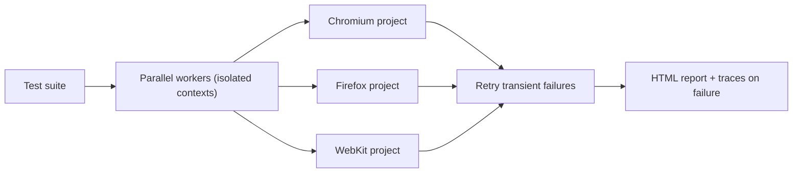

**CI integration** (guide `26`): run headless, shard across machines, upload the HTML report + traces as artifacts. Playwright provides ready CI recipes (GitHub Actions, etc.) and Docker images with browsers preinstalled.

🔑 **Takeaway:** Playwright is **parallel-first** (cheap isolated contexts) — `pytest -n` (Python), built-in workers + **projects** (cross-browser) + **sharding** (JS), JUnit/TestNG threads (Java). Use **retries** as a *safety net* (not a flakiness cure), get rich **HTML reports with traces**, configure everything centrally, and it slots cleanly into **CI** with headless runs, sharding, and artifact upload.

---

# Part IV — Database & SQL Testing

## 20. Why & What to Test in Databases

The UI can look perfect while the **data behind it is wrong** — the wrong amount stored, a duplicate row, a broken relationship, a failed calculation. **Database (back-end) testing** verifies the data layer directly, independent of the UI. It's essential in data-critical domains — especially banking 🏦, where a rounding error or a lost transaction is a serious defect.

**Why test the database:**

- The UI shows only a slice; bugs hide in what's **persisted, transformed, and aggregated**.
- Business rules often live in the DB (constraints, triggers, stored procedures) and need verification.
- **Data integrity** is paramount — corrupted/inconsistent data causes cascading failures and, in finance, real money loss.
- Reports/analytics depend on correct aggregation and ETL (§22).

**What to test (categories):**

| Category | Verifies |
|---|---|
| **Data integrity** | CRUD operations persist correct data; constraints (PK/FK, unique, not-null, check) are enforced |
| **Data validation** | Values match rules/types/ranges; no truncation or corruption |
| **CRUD via app** | UI/API action → correct DB change (create/read/update/delete) |
| **Referential integrity** | Foreign keys valid; no orphan records; cascades behave |
| **Transactions (ACID)** | Atomicity/consistency/isolation/durability — esp. rollback on failure (critical for money 🏦) |
| **Stored procedures / functions / triggers** | Business logic in the DB returns correct results |
| **Data migration / ETL** | Data moves/transforms correctly between systems (§22) |
| **Performance** | Query speed, indexing, no N+1, execution plans (§24, guide `04`) |
| **Security** | Access controls, no SQL injection, encryption of sensitive data 🔒 |

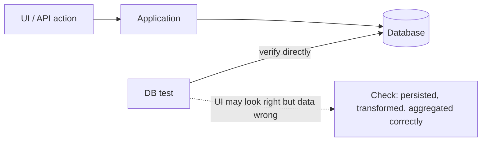

**The core pattern for automated DB validation** — after an action, query the DB and assert:

1. Perform an action (via UI/API, or directly insert test data).
2. **Query the database** to read the actual stored state.
3. **Assert** the stored data matches the expected result (values, counts, relationships).
4. Clean up / roll back so tests stay isolated (§5, §31).

🔒 **Security note:** never test against **production** data or a production DB; use a dedicated test database with **masked/synthetic** data (real PII/account data in test environments is a compliance breach, especially in banking 🏦, §32).

🔑 **Takeaway:** the UI can be right while the **data is wrong**, so **database testing verifies the data layer directly** — **integrity, validation, CRUD, referential integrity, ACID/transactions, stored procs/triggers, ETL/migration, performance, and security**. The pattern is **act → query the DB → assert stored state → clean up**. Always use an **isolated test DB with masked data**, never production.

---

## 21. SQL for Testers: Queries & Validation

Every automation/QA engineer needs working **SQL** — it's how you validate the back end. Here's the practical subset, oriented to testing. (Deep DB fundamentals: guide `04`.)

**The essentials — SELECT and filtering:**

```sql
SELECT id, email, balance FROM accounts WHERE status = 'ACTIVE';
SELECT * FROM orders WHERE total > 100 AND created_at >= '2026-01-01';
SELECT * FROM users WHERE email LIKE '%@example.com';   -- pattern match
SELECT * FROM txns WHERE status IN ('PENDING','FAILED');
SELECT * FROM accounts WHERE balance IS NULL;           -- null check (common validation)
SELECT DISTINCT country FROM users;                     -- unique values
SELECT * FROM orders ORDER BY created_at DESC LIMIT 10;
```

**Aggregations — validating counts, sums, business totals (huge for finance 🏦):**

```sql
SELECT COUNT(*) FROM accounts;                          -- row count
SELECT SUM(amount) FROM transactions WHERE account_id = 42;   -- balance check
SELECT AVG(total), MIN(total), MAX(total) FROM orders;
SELECT status, COUNT(*) FROM orders GROUP BY status;    -- breakdown
SELECT account_id, SUM(amount) FROM txns
  GROUP BY account_id HAVING SUM(amount) < 0;           -- find negative balances (a bug!)
```

**JOINs — verifying relationships across tables:**

```sql
-- Verify each order links to a real customer (referential integrity)
SELECT o.id, c.name FROM orders o JOIN customers c ON o.customer_id = c.id;

-- Find ORPHANS: orders whose customer doesn't exist (a data-integrity bug)
SELECT o.id FROM orders o LEFT JOIN customers c ON o.customer_id = c.id
WHERE c.id IS NULL;
```
Know the join types: **INNER** (matching rows), **LEFT** (all left + matches — the orphan-finder above), **RIGHT**, **FULL**.

**Common validation queries testers write constantly:**

```sql
-- Duplicate detection (should be zero for unique fields)
SELECT email, COUNT(*) FROM users GROUP BY email HAVING COUNT(*) > 1;

-- Data-quality checks
SELECT COUNT(*) FROM users WHERE email NOT LIKE '%@%';         -- invalid emails
SELECT COUNT(*) FROM accounts WHERE balance < 0;              -- negative balances
SELECT * FROM txns WHERE amount != debit + credit;            -- calc mismatch (finance 🏦)

-- Reconciliation: two sources must agree (banking 🏦, §32)
SELECT SUM(amount) FROM ledger_a;   -- must equal...
SELECT SUM(amount) FROM ledger_b;
```

**Data manipulation for test setup/teardown:**

```sql
INSERT INTO users (email, name) VALUES ('test@x.com', 'Test User');
UPDATE accounts SET balance = 1000 WHERE id = 42;             -- set up a test state
DELETE FROM txns WHERE created_at < '2020-01-01';            -- cleanup
```
⚠️ **Always include a `WHERE` clause** on UPDATE/DELETE in test scripts — an accidental `DELETE FROM accounts` (no WHERE) wipes the table. Wrap test data changes in **transactions you roll back**, so tests leave the DB clean (§31).

**Advanced (worth knowing):** subqueries, `EXISTS`, `CASE`, window functions (`ROW_NUMBER() OVER (...)`), CTEs (`WITH ...`) for readable complex validations — and **`EXPLAIN`** to check a query's execution plan when testing performance (§24, guide `04`).

🔑 **Takeaway:** testers need practical **SQL** — **SELECT/WHERE/LIKE/IN/IS NULL** for lookups, **aggregations (COUNT/SUM/AVG/GROUP BY/HAVING)** for validating totals and finding bad data, **JOINs** (esp. **LEFT JOIN ... IS NULL** to find orphans) for referential integrity, and validation queries for **duplicates, data quality, calc mismatches, and reconciliation** (vital in finance 🏦). Use **transactions you roll back** for clean setup/teardown, and **always `WHERE` your UPDATE/DELETE**.

---

## 22. Data Integrity, ETL & DB Testing in Automation

Beyond ad-hoc queries, you automate database checks inside your test framework and validate data pipelines.

**DB validation inside automated tests** — connect to the DB from your test code and assert on query results:

**Python (with a DB driver, e.g. `psycopg`/`pymysql`, inside pytest):**

```python
import psycopg
import pytest

@pytest.fixture
def db():
    conn = psycopg.connect(DATABASE_URL)   # a TEST db, never prod
    yield conn
    conn.rollback(); conn.close()          # roll back → tests stay isolated

def test_payment_persists_correctly(db, page):
    # 1. Act via UI (Selenium/Playwright) or API
    make_payment(page, amount="100.00", account="42")
    # 2. Query the DB for the actual stored state
    with db.cursor() as cur:
        cur.execute("SELECT amount, status FROM transactions WHERE account_id=%s "
                    "ORDER BY created_at DESC LIMIT 1", (42,))
        amount, status = cur.fetchone()
    # 3. Assert
    assert amount == Decimal("100.00")     # exact — never float for money! 🏦
    assert status == "COMPLETED"
```

**Java (JDBC, inside JUnit):**

```java
try (Connection conn = DriverManager.getConnection(url, user, pass);
     PreparedStatement ps = conn.prepareStatement(
         "SELECT amount, status FROM transactions WHERE account_id = ?")) {
    ps.setInt(1, 42);
    try (ResultSet rs = ps.executeQuery()) {
        assertTrue(rs.next());
        assertEquals(new BigDecimal("100.00"), rs.getBigDecimal("amount"));  // BigDecimal for money 🏦
        assertEquals("COMPLETED", rs.getString("status"));
    }
}
```
⚠️ Always use **parameterized queries** (`?`/`%s`), never string concatenation — prevents SQL injection *and* quoting bugs even in tests 🔒.

**ETL / data-pipeline testing** — validating that data extracted from a source, transformed, and loaded into a target is correct (data warehouses, migrations, integrations). Common in banking (nightly batch reconciliation 🏦):

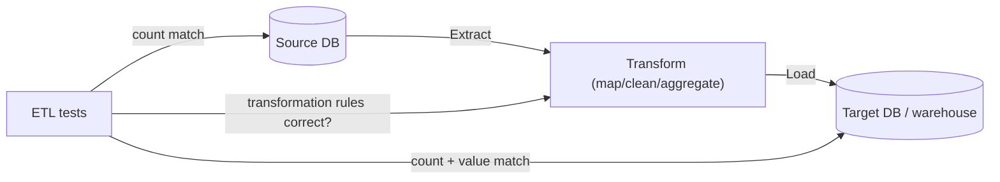

**What ETL testing checks:**

- **Completeness** — row counts match (source vs target); nothing lost or duplicated.
- **Correctness of transformation** — mapping/derivation rules applied right (e.g. currency conversion, categorization).
- **Data quality** — no nulls where required, valid formats, no truncation.
- **Reconciliation** — aggregate totals agree between source and target (a `SUM` on each must match — critical for financial ledgers 🏦, §32).
- **Referential integrity** preserved after load.

**Data integrity in automation — key rules:**

- **Isolate & clean up** — each test sets up its own data and rolls back/cleans up so tests don't interfere (a top flakiness cause, §31). Prefer transactions rolled back, or unique test data per run.
- **Deterministic data** — don't depend on pre-existing shared data that changes.
- **Exact types for money** — use `DECIMAL`/`BigDecimal`/`Decimal`, **never floats** (float rounding = financial bugs 🏦).
- **Mask/synthesize** sensitive data in test DBs 🔒.

🔑 **Takeaway:** automate DB checks by **connecting from test code** (psycopg/JDBC), performing an action, then **querying and asserting the stored state** — using **parameterized queries**, **rolled-back transactions for isolation**, and **exact decimal types for money**. For pipelines, **ETL testing** validates **completeness (counts), transformation correctness, data quality, reconciliation (matching sums), and integrity** — the backbone of trustworthy reporting and financial batch processing 🏦.

---

# Part V — API, Performance & Specialized Testing

## 23. API Testing (REST & GraphQL)

**API testing** verifies the application's programming interfaces directly — the layer between the UI and the back end. It's **faster, more stable, and cheaper** than UI testing (no browser, no rendering), sits at the **integration** level of the pyramid (§3), and often gives the best confidence-per-cost. Prefer testing business logic through the API over the UI wherever you can.

**What to verify in an API test:**

- **Status code** (200, 201, 400, 401, 404, 422, 500 — correct code for each scenario).
- **Response body** — correct data, structure, and types (**schema validation**).
- **Headers** (content-type, auth, caching, rate-limit).
- **Response time** (within SLA).
- **Error handling** — bad/missing/invalid input → correct error code + message (negative testing!).
- **Auth & authorization** — endpoints require the right token/role; 401 vs 403 (🔒 critical in banking).
- **Data effects** — the call actually changed the back-end state (pair with DB checks, §22).
- **Contract** — request/response match the agreed schema (contract testing, below).

**Tools:**

- **Postman** — GUI for exploration + collections + automated collection runs (with `newman` in CI). Great for manual/semi-automated API testing and learning.
- **REST Assured** (Java) — the standard Java API-testing DSL.
- **`requests` + pytest** (Python) — simple, powerful, code-first.
- **Playwright's `APIRequestContext`** — API testing in the same framework as your UI tests (nice for setup/teardown and mixed flows).
- **Karate**, **SoapUI** (incl. legacy SOAP), **Pact** (contract testing).

**Python (`requests` + pytest):**

```python
import requests

BASE = "https://api.example.com"

def test_get_user_returns_200_and_correct_shape():
    r = requests.get(f"{BASE}/users/42", headers={"Authorization": f"Bearer {TOKEN}"})
    assert r.status_code == 200
    body = r.json()
    assert body["id"] == 42
    assert "email" in body and "@" in body["email"]   # basic schema/data check

def test_create_order_negative_missing_field():
    r = requests.post(f"{BASE}/orders", json={}, headers=AUTH)   # invalid: empty body
    assert r.status_code == 422                                  # negative test
    assert "amount" in r.json()["errors"]

def test_unauthorized_without_token():
    r = requests.get(f"{BASE}/users/42")                         # no auth
    assert r.status_code == 401                                  # 🔒 authz check
```

**Java (REST Assured):**

```java
import static io.restassured.RestAssured.*;
import static org.hamcrest.Matchers.*;

given()
    .header("Authorization", "Bearer " + token)
.when()
    .get("https://api.example.com/users/42")
.then()
    .statusCode(200)
    .body("id", equalTo(42))
    .body("email", containsString("@"))
    .time(lessThan(500L));   // response-time assertion
```

**Playwright API testing (Python):**

```python
def test_api(playwright):
    api = playwright.request.new_context(base_url="https://api.example.com",
                                         extra_http_headers={"Authorization": f"Bearer {TOKEN}"})
    resp = api.post("/orders", data={"amount": "100.00"})
    assert resp.ok
    assert resp.json()["status"] == "created"
```

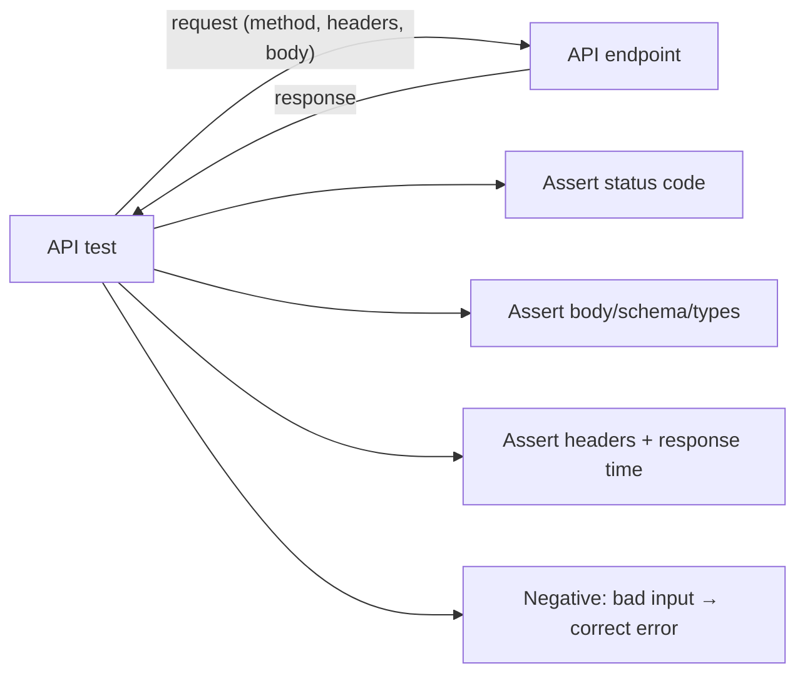

**Schema & contract testing:**

- **Schema validation** — validate the response against a **JSON Schema**/OpenAPI spec so structure/types are enforced (not just spot-checks).
- **Contract testing (e.g. Pact)** — ensures a provider and consumer agree on the API contract, catching breaking changes *before* integration (vital in microservices, guide `33`/`29`).

**GraphQL** — POST a query to a single endpoint; assert on the returned data and errors. Test query correctness, field-level authorization, and that you fetch exactly what's requested (guide `18`).

🔑 **Takeaway:** **API testing** is faster/stabler than UI testing and gives great confidence-per-cost — verify **status code, body/schema, headers, response time, error handling, and auth**, always including **negative and authorization** cases, and pair with **DB checks** for data effects. Use **`requests`+pytest** (Python), **REST Assured** (Java), **Postman/newman**, or **Playwright's API context**. Add **schema validation** and **contract testing (Pact)** to catch breaking changes early.

---

## 24. Performance & Load Testing

**Performance testing** verifies non-functional qualities — speed, stability, and scalability under load. It answers "how does the system behave with many users / much data?" — impossible to check manually, and critical for high-traffic and financial systems 🏦.

**The types (know these — a frequent interview topic):**

| Type | Question it answers |
|---|---|
| **Load testing** | Does it meet performance goals under *expected* load? |
| **Stress testing** | Where does it *break*? Behavior beyond capacity (and does it fail gracefully?) |
| **Spike testing** | How does it handle a *sudden* surge (e.g. flash sale, market open 🏦)? |
| **Soak / endurance testing** | Does it stay healthy over a *long* period (memory leaks, resource exhaustion)? |
| **Scalability testing** | How does performance change as you add load/resources? Does it scale? |
| **Volume testing** | Behavior with a *large amount of data* in the DB |

**Key metrics:**

- **Response time** — reason in **percentiles (p95/p99)**, not averages (a good average hides a bad tail — guide `33`).
- **Throughput** — requests/transactions per second the system handles.
- **Error rate** — % of failed requests under load.
- **Concurrency** — simultaneous users/connections.
- **Resource utilization** — CPU, memory, DB connections, I/O (find the bottleneck).

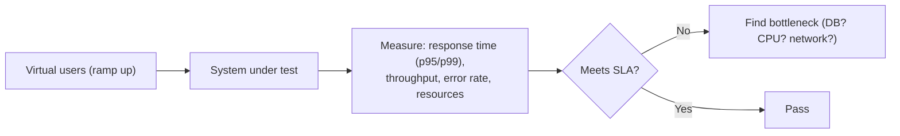

**Tools:**

- **JMeter** — the veteran, GUI + XML, huge protocol support, strong for enterprise/complex scenarios.
- **k6** (Grafana) — modern, code-first (JavaScript), developer-friendly, great CI integration. A popular current choice.
- **Gatling** (Scala/Java DSL), **Locust** (Python, code-first) — code-first load tools.
- **Cloud/managed** — BlazeMeter, k6 Cloud for large distributed load.

**k6 example (JavaScript):**

```javascript
import http from 'k6/http';
import { check, sleep } from 'k6';

export const options = {
  stages: [
    { duration: '30s', target: 100 },   // ramp to 100 virtual users
    { duration: '1m',  target: 100 },   // hold
    { duration: '30s', target: 0 },     // ramp down
  ],
  thresholds: { http_req_duration: ['p(95)<500'] },   // p95 under 500ms or FAIL
};

export default function () {
  const res = http.get('https://api.example.com/products');
  check(res, { 'status 200': (r) => r.status === 200 });
  sleep(1);
}
```

**The process:** define goals/SLAs → model realistic scenarios (user journeys, think-time, ramp-up) → prepare a **production-like environment** (results are meaningless on a tiny test box) → run → analyze metrics → **find the bottleneck** (DB queries? missing index, guide `04`? CPU? connection pool?) → optimize → re-test.

⚠️ **Common mistakes:** testing on an under-resourced environment, no ramp-up (unrealistic instant load), ignoring think-time, chasing averages instead of p95/p99, and load-testing production without safeguards. 🏦 In banking, always load-test peak scenarios (payday, market open, month-end batch).

🔑 **Takeaway:** **performance testing** verifies speed/stability/scalability under load — know **load, stress, spike, soak, scalability, volume** — measuring **response time (p95/p99), throughput, error rate, and resource use** to **find the bottleneck**. Use **k6** (modern, code-first), **JMeter** (enterprise), Gatling/Locust. Test in a **production-like environment** with realistic **ramp-up + think-time**, and reason in **percentiles, not averages**.

---

## 25. Security, Accessibility, Visual & Mobile Testing

A tour of specialized testing types every well-rounded QA engineer should know.

**Security testing** 🔒 — verifies the app resists threats (huge in banking 🏦):

- **The OWASP Top 10** is the reference checklist: injection (SQL/command), broken authentication, broken access control (can user A see user B's data?), sensitive-data exposure, security misconfiguration, XSS, etc.
- **Common test types:** input validation / injection (SQLi, XSS), authentication & session management, **authorization** (privilege escalation, IDOR — accessing another user's record by changing an ID), data encryption (in transit/at rest), and **penetration testing** (simulated attacks).
- **Tools:** OWASP **ZAP**, **Burp Suite** (proxy-based scanning), plus **SAST** (static code scanning) and **DAST** (dynamic scanning) in CI, and dependency scanners (guide `26`).
- 🏦 In banking, add: PCI-DSS controls for card data, secure PIN/credential handling, fraud-rule verification, and audit-trail integrity.

**Accessibility testing (a11y)** — verifies usability by people with disabilities, against **WCAG** guidelines (perceivable, operable, understandable, robust):

- **Automated checks** — **axe-core** (via `axe-playwright`/`axe-selenium`), Lighthouse, WAVE catch a large share of issues (color contrast, missing alt text, missing labels, ARIA misuse).
- ⚠️ **Automated tools catch only ~30–50% of issues** — full WCAG compliance needs **manual testing** (keyboard-only navigation, screen readers like NVDA/VoiceOver, focus order) and expert review.
- 💡 Using **role/label locators** (Playwright §16) doubles as light a11y coverage — if your test can find a button "by role and accessible name," so can a screen reader.

```python
# Accessibility scan with axe + Playwright (Python)
from axe_playwright_python.sync_playwright import Axe
results = Axe().run(page)
assert len(results.violations) == 0
```

**Visual (regression) testing** — catches *visual* bugs (layout shifts, broken CSS, unintended UI changes) that functional tests miss, by comparing screenshots against a baseline:

- **Playwright** has built-in visual comparison: `expect(page).to_have_screenshot()` (pixel diff against a stored baseline).
- **Tools:** Applitools (AI-based, tolerant of minor rendering diffs), Percy, and Playwright/Cypress snapshot testing.
- ⚠️ Pixel-diffs can be flaky across environments (fonts, rendering) — use tolerance thresholds and consistent (often containerized) rendering.

**Mobile testing:**

- **Responsive/mobile-web** — Playwright **device emulation** (`playwright.devices["iPhone 15"]`, §17) or Selenium with mobile viewports. Good for responsive layout, not real-device behavior.
- **Native/hybrid mobile apps** — **Appium** is the standard (a Selenium-like WebDriver-based tool for iOS/Android native apps); same locator/wait concepts, different element strategies.
- **Real-device clouds** — BrowserStack/Sauce Labs for testing on actual devices/OS versions.

🔑 **Takeaway:** round out your skills with **security** (OWASP Top 10, injection/authz/IDOR, ZAP/Burp, SAST/DAST — and PCI-DSS/fraud in banking 🏦), **accessibility** (WCAG via axe/Lighthouse, but ~30–50% automatable → manual keyboard/screen-reader testing needed), **visual regression** (screenshot baselines via Playwright/Applitools/Percy — mind rendering flakiness), and **mobile** (emulation for responsive, **Appium** for native, real-device clouds for coverage).

---

# Part VI — Automation Engineering

## 26. Test Framework Design: JUnit/TestNG & pytest

A **test framework** is the structure around your tests — the runner, assertions, setup/teardown, configuration, reporting, and conventions. The tool (Selenium/Playwright) drives the browser; the **framework** organizes and executes the tests.

**Java — JUnit 5 vs TestNG:**

- **JUnit 5** — the modern Java standard. Annotations: `@Test`, `@BeforeEach`/`@AfterEach` (per test), `@BeforeAll`/`@AfterAll` (per class), `@DisplayName`, `@Disabled`. **Parameterized tests** (`@ParameterizedTest` + `@ValueSource`/`@CsvSource`/`@MethodSource`). Assertions via `Assertions.assertEquals(...)` or AssertJ (`assertThat(x).isEqualTo(y)` — fluent, readable).
- **TestNG** — popular in Selenium suites; adds built-in **`@DataProvider`** (data-driven), flexible **grouping** (`@Test(groups=...)`), **dependencies** (`dependsOnMethods`), **priorities**, **parallel execution** config in `testng.xml`, and `@BeforeSuite`/`@BeforeTest` hooks. Choose TestNG for its rich suite/parallel/grouping config; JUnit 5 for the modern default + ecosystem.

```java
// JUnit 5 parameterized test
@ParameterizedTest
@CsvSource({"3,4,7", "0,0,0", "-1,1,0"})
void adds(int a, int b, int expected) {
    assertEquals(expected, calc.add(a, b));
}
```

**Python — pytest** (the de-facto standard; far more popular than `unittest`):

- **Plain `assert`** (pytest rewrites it for great failure messages — no `assertEquals` needed).
- **Fixtures** (`@pytest.fixture`) for setup/teardown/dependency-injection, with **scopes** (`function`/`class`/`module`/`session`) and `yield` for teardown. This is pytest's superpower.
- **Parametrize** for data-driven tests; **markers** (`@pytest.mark.smoke`) to group/select; rich **plugin ecosystem** (`pytest-xdist` parallel, `pytest-html`/`allure` reports, `pytest-playwright`, `pytest-rerunfailures`).

```python
import pytest

@pytest.fixture
def calc():
    return Calculator()          # setup; add `yield` + teardown if needed

@pytest.mark.parametrize("a,b,expected", [(3,4,7), (0,0,0), (-1,1,0)])
def test_add(calc, a, b, expected):
    assert calc.add(a, b) == expected

# conftest.py — shared fixtures auto-discovered across the suite (e.g. `driver`, `page`)
```

**Framework structure — organize for maintainability** (a typical layout):

```
tests-framework/
├── tests/                 # test cases (grouped by feature)
├── pages/                 # Page Objects (POM, §34)
├── fixtures/ or utils/    # setup, helpers, data builders
├── config/                # env configs (URLs, credentials via env vars/secrets)
├── data/                  # test data files (CSV/JSON/YAML)
├── reports/               # generated reports
├── conftest.py            # (Python) shared fixtures
└── pom.xml / requirements.txt / package.json
```

**Framework essentials** (what a good framework provides):

- **Setup/teardown** hooks (fixtures/annotations) — driver creation, login, DB connection, cleanup.
- **Configuration management** — environment-specific config (dev/staging/prod URLs, credentials from **env vars/secrets**, never hard-coded 🔒).
- **Reusable components** — Page Objects, helpers, data builders (DRY).
- **Assertions** — clear, fluent, with good failure messages.
- **Reporting & logging** (§29), **parallelism** (§13, §19), and **CI integration** (§30).

🔑 **Takeaway:** the **framework** organizes tests around the automation tool. In **Java**, use **JUnit 5** (modern default, `@ParameterizedTest`) or **TestNG** (rich `@DataProvider`/grouping/parallel config for Selenium suites); in **Python**, **pytest** dominates (plain `assert`, **fixtures** with scopes, **parametrize**, huge plugin ecosystem). Structure for maintainability (**tests / pages / config / data / utils**), externalize config/secrets, and build in setup-teardown, reporting, parallelism, and CI hooks.

---

## 27. BDD: Cucumber & Behave

**Behavior-Driven Development (BDD)** expresses tests as **plain-language behavior specifications** that non-technical stakeholders (product, business, QA) can read and even help write — bridging the gap between requirements and automated tests. Especially valued in regulated domains (banking 🏦) where business rules must be traceable and auditable.

**Gherkin syntax** — the `Given-When-Then` structure:

```gherkin
Feature: Account withdrawal

  Scenario: Successful withdrawal within balance
    Given the account "12345" has a balance of 1000.00
    When the customer withdraws 300.00
    Then the withdrawal should succeed
    And the new balance should be 700.00

  Scenario: Withdrawal exceeding balance is rejected
    Given the account "12345" has a balance of 100.00
    When the customer withdraws 500.00
    Then the withdrawal should be rejected with "Insufficient funds"
```

- **Given** = preconditions/context; **When** = the action; **Then** = expected outcome. **And/But** chain steps. **Scenario Outline** + **Examples** table = data-driven scenarios.

**Step definitions** — glue code that maps each Gherkin step to test automation:

**Java (Cucumber-JVM):**

```java
@Given("the account {string} has a balance of {double}")
public void accountHasBalance(String acct, double balance) {
    testAccount = accountService.setBalance(acct, BigDecimal.valueOf(balance));
}

@When("the customer withdraws {double}")
public void withdraws(double amount) {
    result = accountService.withdraw(testAccount, BigDecimal.valueOf(amount));
}

@Then("the new balance should be {double}")
public void balanceShouldBe(double expected) {
    assertEquals(BigDecimal.valueOf(expected), testAccount.getBalance());
}
```

**Python (Behave, or `pytest-bdd`):**

```python
from behave import given, when, then

@given('the account "{acct}" has a balance of {balance:f}')
def step_balance(context, acct, balance):
    context.account = set_balance(acct, Decimal(str(balance)))

@when('the customer withdraws {amount:f}')
def step_withdraw(context, amount):
    context.result = withdraw(context.account, Decimal(str(amount)))

@then('the new balance should be {expected:f}')
def step_check(context, expected):
    assert context.account.balance == Decimal(str(expected))
```

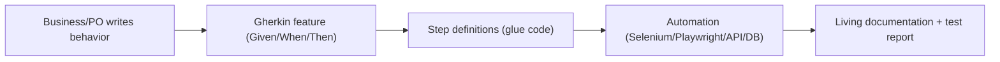

**Benefits:** shared understanding (one language for business + dev + QA), **living documentation** (features stay in sync with tests), traceability to requirements (🏦 audit-friendly), and reusable steps.

⚠️ **BDD pitfalls (common and costly):** using Gherkin for *everything* (it adds a glue-code layer — overkill for pure technical/unit tests); writing **UI-coupled** steps ("click the button with id X") instead of **behavior** ("the customer withdraws"); and step-definition sprawl/duplication. **Use BDD where business collaboration adds value**, keep scenarios about *behavior* not implementation, and keep steps reusable. Not every project needs BDD.

🔑 **Takeaway:** **BDD** writes tests as readable **Given-When-Then (Gherkin)** behavior specs that business + dev + QA share, backed by **step definitions** (glue code) that drive the automation — via **Cucumber** (Java) or **Behave/pytest-bdd** (Python). It gives **shared understanding + living documentation + traceability** (great for banking audits 🏦). Use it **where collaboration adds value**, keep scenarios about **behavior not UI mechanics**, and don't force it on everything.

---

## 28. Data-Driven & Keyword-Driven Frameworks

Two classic framework *architectures* that separate test *logic* from test *data* or *actions* — reducing duplication and letting non-coders contribute.

**Data-driven testing** — run the **same test logic** with **multiple sets of input data** from an external source (CSV/JSON/Excel/DB). One test, many datasets → broad coverage without duplicated code. This is the workhorse pattern (e.g. test login with 20 username/password combinations, or a payment flow with many amounts/currencies 🏦).

**pytest (parametrize / external data):**

```python
import json, pytest

with open("data/login_cases.json") as f:
    cases = json.load(f)   # [{"user":"a","pass":"x","expected":"success"}, ...]

@pytest.mark.parametrize("case", cases, ids=[c["desc"] for c in cases])
def test_login(page, case):
    login(page, case["user"], case["pass"])
    assert_result(page, case["expected"])
```

**TestNG (`@DataProvider`):**

```java
@DataProvider(name = "loginData")
public Object[][] loginData() {
    return new Object[][] {
        {"validUser", "validPass", "success"},
        {"validUser", "wrongPass", "invalid credentials"},
        {"", "", "required"},
    };
}
@Test(dataProvider = "loginData")
public void testLogin(String user, String pass, String expected) { /* ... */ }
```

**Keyword-driven testing** — abstract actions into reusable **keywords** (e.g. `Open`, `Type`, `Click`, `Verify`) defined in a table/spreadsheet, so **non-programmers** can build tests by sequencing keywords with data. Test steps live as data (keyword + locator + value); an engine executes them.

```
| Keyword | Target        | Value            |
| open    | /login        |                  |
| type    | #email        | user@example.com |
| type    | #password     | secret           |
| click   | #submit       |                  |
| verify  | .welcome      | Welcome back     |
```

- **Robot Framework** (Python-based) is the best-known keyword-driven framework (with Selenium/Browser libraries; the Browser library uses Playwright under the hood). Great for teams wanting readable, keyword-style tests.

**Hybrid frameworks** combine approaches — e.g. **data-driven + Page Object Model (§34) + BDD** — which is what most real-world enterprise frameworks actually are.

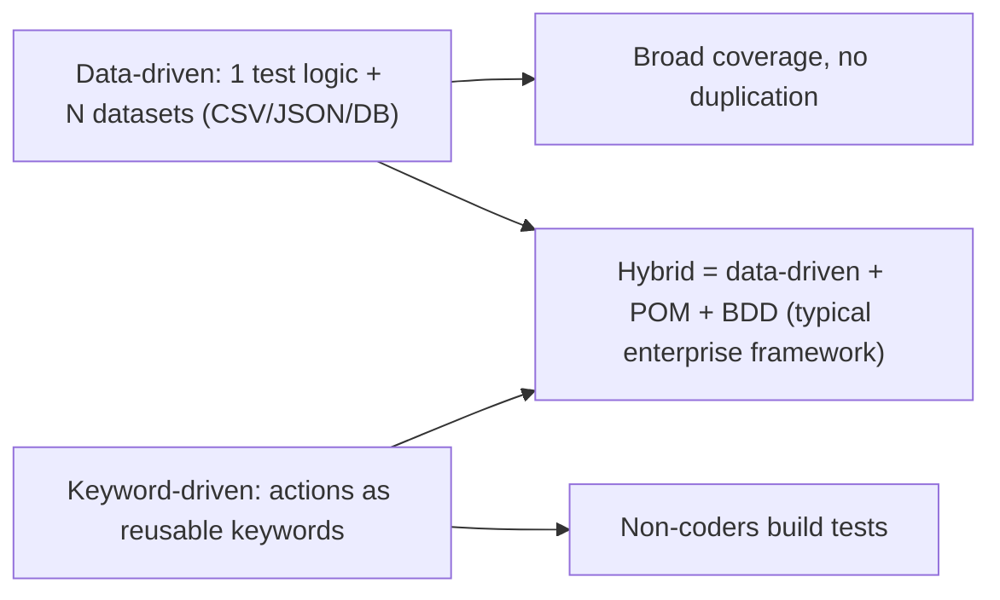

⚠️ Don't over-abstract. Keyword-driven frameworks can become a hard-to-debug DSL that's more complex than code; adopt them only when non-programmers genuinely need to author tests. **Data-driven parametrization**, by contrast, is broadly useful and low-cost — use it liberally.

🔑 **Takeaway:** **data-driven** testing runs one test logic over **many external datasets** (pytest `parametrize`, TestNG `@DataProvider`) — cheap, high-coverage, use it liberally. **Keyword-driven** testing abstracts actions into **reusable keywords** so **non-coders** can author tests (Robot Framework) — powerful but can over-abstract; use when needed. Real enterprise frameworks are usually **hybrid** (data-driven + POM + BDD).

---

## 29. Reporting, Logging & Test Data Management

A test suite that runs but produces no clear evidence is nearly useless — **reporting, logging, and test-data management** turn runs into actionable information.

**Reporting** — communicates results to the team/stakeholders:

- **What a good report has:** pass/fail counts + trends, per-test status and duration, **failure details** (error, stack trace, **screenshot/video/trace** at the point of failure), grouping by feature, and history over time.
- **Tools:** **Allure** (rich, popular, cross-language — Java/Python/JS, with steps/attachments/history), **ExtentReports** (Java, HTML), Playwright's built-in **HTML report** (with traces), **pytest-html**, and **JUnit-XML** output (the lingua franca CI dashboards consume).
- 🏦 In regulated domains, reports double as **audit evidence** — keep them, timestamped, with traceability to requirements.

```python
# pytest: attach a screenshot to the report on failure (Allure or pytest-html)
@pytest.hookimpl(hookwrapper=True)
def pytest_runtest_makereport(item, call):
    outcome = yield
    rep = outcome.get_result()
    if rep.when == "call" and rep.failed:
        page = item.funcargs.get("page")
        if page: allure.attach(page.screenshot(), name="failure",
                               attachment_type=allure.attachment_type.PNG)
```

**Logging** — the trail for debugging failures (esp. in CI where you can't watch):

- Log **key actions and state** (navigation, inputs used—**never secrets/PII** 🔒, assertions, decisions), at appropriate levels (INFO for flow, DEBUG for detail, ERROR for failures).
- Use the language logger (Java SLF4J/Logback, Python `logging`), not `print`/`System.out`.
- **Correlate** logs with the test name/run so a CI failure is traceable (ties to observability, guide `30`).
- **Capture on failure:** screenshot + page source (Selenium) or **trace** (Playwright, §18) — the single most valuable debugging artifact.

**Test Data Management (TDM)** — arguably the hardest part of stable automation:

- **Independent, self-contained data** — each test creates/owns its data (via API/DB setup or fixtures) and cleans up. Sharing mutable data across tests is a top flakiness cause (§31).
- **Strategies:** create fresh data per test (via API/factory — most reliable); use transactions rolled back after each test (fast, clean, §22); or seed a known dataset and reset between runs.
- **Data builders / factories** — helpers that generate valid test objects with sensible defaults + overrides (e.g. `a_customer(balance=1000)`).
- 🔒 **Never use production/real PII** — mask or synthesize (Faker-style generators). Critical and legally required in banking 🏦 (§32).
- **Environment parity** — test data/config should mirror production shape (guide `26`/`25`).

🔑 **Takeaway:** make runs actionable with **rich reporting** (Allure/ExtentReports/Playwright HTML + **screenshots/traces on failure**, JUnit-XML for CI — and audit evidence in banking 🏦), proper **logging** (loggers not prints, key actions, **no secrets/PII**, capture screenshot/trace on failure), and disciplined **test-data management** (independent self-cleaning data via factories/rolled-back transactions, **masked/synthetic data, never production PII**). Good TDM is the biggest lever on suite stability.

---

## 30. CI/CD for Test Automation

Automated tests deliver their value when they run **automatically on every change** — that's the whole point of automation. Integrating tests into **CI/CD** (guide `26`) is what enables fast, safe delivery.

**Where tests run in a pipeline:**

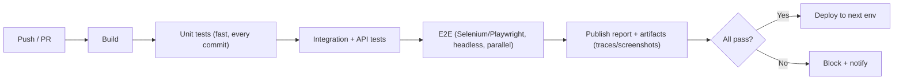

**Key practices:**

- **Test pyramid maps to pipeline stages** — run **fast unit tests first** (fail fast on every commit), then integration/API, then a **thin E2E layer**. Don't gate every commit on a 40-minute UI suite.
- **Headless + parallel + sharded** — run browsers headless, parallelize (Grid/xdist/Playwright workers, §13/§19), and **shard** across CI machines to keep wall-clock time low.
- **Fail fast, fail loud** — a red build blocks merge/deploy and notifies (Slack, guide `26`). Tests are only valuable if failures actually stop bad code.
- **Publish artifacts** — HTML report, **traces/screenshots/videos on failure** (§29), JUnit-XML for the CI dashboard. This is how you debug a CI-only failure.
- **Ephemeral environments** — spin up a fresh app + DB per run (Docker/Compose, guide `25`) for isolation and parity; tear down after.
- **Manage secrets** via the CI secret store (never hard-coded 🔒).
- **Quarantine flaky tests** (§31) rather than letting them erode trust in the whole suite.

**Example (GitHub Actions, Playwright + Python):**

```yaml
name: e2e
on: [push, pull_request]
jobs:
  test:
    runs-on: ubuntu-latest
    steps:
      - uses: actions/checkout@v4
      - uses: actions/setup-python@v5
        with: { python-version: '3.12' }
      - run: pip install pytest-playwright && playwright install --with-deps
      - run: pytest -n 4 --tracing retain-on-failure --html=report.html
        env: { BASE_URL: ${{ vars.BASE_URL }}, TEST_TOKEN: ${{ secrets.TEST_TOKEN }} }
      - uses: actions/upload-artifact@v4        # keep traces/report for debugging
        if: always()
        with: { name: test-results, path: report.html }
```

**Test selection strategies:** run **smoke tests** on every PR (fast confidence), the **full regression** nightly or pre-release, and **tag/group** tests (`@smoke`, `@regression`, `@critical`) to control what runs when.

🔑 **Takeaway:** automation pays off by running in **CI/CD on every change** — **unit → integration/API → thin E2E**, **headless + parallel + sharded** for speed, **failing fast and loud** to block bad code, and **publishing reports + traces/screenshots** as artifacts for debugging. Use **ephemeral Dockerized environments**, **CI-managed secrets**, tag tests for **smoke-on-PR / full-regression-nightly**, and **quarantine flaky tests** so they don't erode trust.

---

## 31. Flaky Tests: Causes & Cures

A **flaky test** passes sometimes and fails other times **without any code change**. Flakiness is the single biggest threat to an automation suite's value: it destroys **trust** ("just re-run it"), hides real bugs, and wastes time. Managing flakiness is a defining skill of a senior automation engineer.

**Why flakiness is so damaging:** once a suite is flaky, people stop believing failures, start blindly re-running, and eventually ignore the suite entirely — so a real regression slips through. A smaller, **reliable** suite beats a large flaky one.

**The common causes (and cures):**

| Cause | Cure |
|---|---|
| **Timing / async** (acting before ready) — #1 cause | **Explicit waits** (Selenium §11) or **auto-waiting + web-first assertions** (Playwright §16); **never `sleep`** |
| **Test interdependence** (order/shared state) | Make tests **independent & isolated**; fresh data per test; own setup/teardown (§29) |
| **Poor locators** (auto-gen classes, positional XPath) | **Stable locators** (`data-testid`, role/label) (§9, §16) |
| **Shared mutable test data** | **Isolated data** (unique per test / rolled-back transactions) (§22, §29) |
| **Test environment instability** (slow/unreliable staging, third-party APIs) | **Mock/stub** externals (§18), stable env, retries as a *safety net* |
| **Animations / dynamic content** | Wait for stable state; disable animations in test config |
| **Race conditions in parallel runs** | Ensure thread-safety/isolation (ThreadLocal driver §13, per-test context §17) |
| **Non-deterministic data** (timestamps, random, ordering) | Control/mock time & randomness; don't assert on unstable order |
| **Network flakiness** | Mock unreliable dependencies; retry idempotent calls |

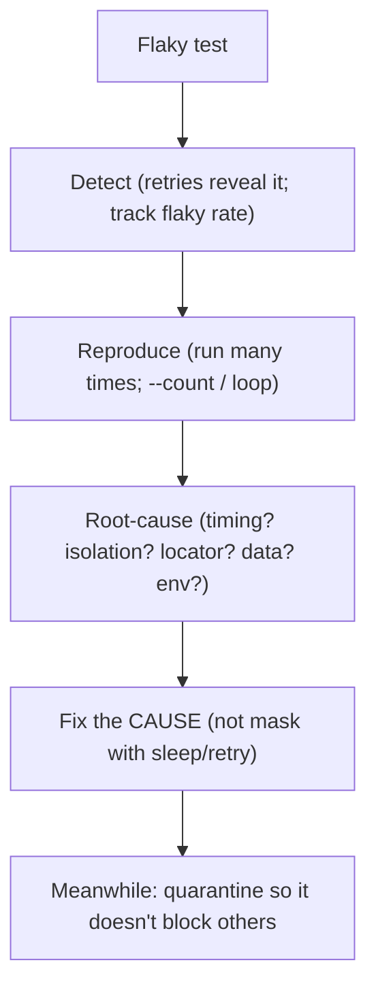

**How to handle flakiness (the process):**

1. **Detect & measure** — track flaky rate; retries that "pass on 2nd try" flag flaky tests (§19). Don't ignore them.
2. **Quarantine** — move a known-flaky test out of the blocking suite so it doesn't erode trust, but **track it as debt** (don't just delete it).
3. **Reproduce** — run it many times locally (`pytest --count=50`, loop) to make the flake appear.
4. **Root-cause & fix the actual cause** — usually timing or isolation. ⚠️ **Adding `sleep` or blanket retries "fixes" the symptom while hiding the bug** — a trap. Retries are a *safety net for genuinely transient infra issues*, not a substitute for fixing a real race.
5. **Prevent** — good waits, isolated data, stable locators, mocked externals, and reviewing new tests for these traps.

💡 **Pro tip:** the two highest-leverage anti-flakiness moves are (1) **proper synchronization** (auto-waiting/explicit waits, never sleeps) and (2) **test isolation** (independent, self-contained data). Nail those and most flakiness disappears — which is a strong argument for Playwright's built-in auto-waiting (§16) on new projects.

🔑 **Takeaway:** **flaky tests** (pass/fail without code change) **destroy trust** in the suite and hide real bugs. The top causes are **timing/async** and **test interdependence/shared data** — cured by **proper waits (never `sleep`)** and **isolation (independent, self-cleaning data)**, plus **stable locators** and **mocking flaky externals**. **Detect → quarantine → reproduce → fix the root cause** (don't mask with sleeps/retries). Reliability beats coverage: a trustworthy small suite > a flaky large one.

---

# Part VII — Payment Testing in Banking

## 32. Banking & Payments Testing (Domain, Flows, Compliance)

🏦 Testing payment and banking systems is a **specialized, high-stakes discipline**. A bug here isn't a cosmetic glitch — it can mean **lost money, double charges, failed settlements, fraud, regulatory fines, or legal liability**. The core mindset shift: **correctness, security, and auditability outrank speed**, and the **money must always be exactly right** (never off by a cent). This section covers the domain knowledge, flows, compliance, and test scenarios a QA/automation engineer needs in fintech/banking.

### The domain: why it's different

- **Zero tolerance for money errors** — a rounding bug, a lost transaction, or a double-debit is a critical defect. Amounts must reconcile to the cent.
- **Regulated & audited** — PCI-DSS (cards), local banking regulations (RBI in India, PSD2/SCA in EU, etc.), AML/KYC. Testing must produce **audit evidence** and never expose real data.
- **Many actors** — customer, merchant, acquiring bank, issuing bank, card networks (Visa/Mastercard/RuPay), payment gateways/processors, and clearing/settlement systems. A payment touches many systems.
- **Asynchronous & eventual** — authorization is instant, but **settlement/clearing** happens later (often nightly batch); tests must account for this timing.
- **Idempotency is mandatory** — network retries must never double-charge (§17 in guide `33`).

### Payment types & flows to know

| Type | Notes |
|---|---|
| **Card payments** | Debit/credit via networks; auth → capture → settle; 3-D Secure (OTP/SCA) |
| **UPI** (India) | Real-time bank-to-bank via VPA; collect/pay requests |
| **NEFT / RTGS / IMPS** (India) | Batch (NEFT), real-time high-value (RTGS), instant 24×7 (IMPS) |
| **ACH / SEPA / Wire** | US ACH batches, EU SEPA, cross-border wires |
| **Wallets / Net-banking** | Stored-value wallets; bank redirect flows |
| **Refunds / reversals / chargebacks** | Money flowing back; partial/full; disputes |

**The card payment flow (the canonical one to understand):**

```mermaid
sequenceDiagram
    participant C as Customer
    participant M as Merchant/App
    participant G as Payment Gateway
    participant A as Acquiring Bank
    participant N as Card Network (Visa/MC)
    participant I as Issuing Bank
    C->>M: Enter card details
    M->>G: Send payment request
    G->>A: Forward
    A->>N: Route
    N->>I: Authorization request
    I-->>N: Approve/Decline (+ 3DS/OTP)
    N-->>A-->>G-->>M: Auth result
    M-->>C: Success / failure
    Note over A,I: Later (batch): CAPTURE → CLEARING → SETTLEMENT (money actually moves)
```

Key stages: **Authorization** (is the card valid, funds available? — a hold, no money moves yet) → **Capture** (merchant confirms the charge) → **Clearing** (networks exchange transaction data) → **Settlement** (funds actually transfer, usually batch/next-day). Testers must validate each stage and the **timing/state transitions** between them.

### What to test (payment test scenarios)

**Positive (happy path):**

- Successful payment for each method (card/UPI/NEFT/etc.) — correct amount debited, credited, and recorded; correct receipt/confirmation.
- Successful capture, then settlement reflects correctly.
- Successful refund (full and **partial**) restores the correct amount.

**Negative (critical — where the real bugs and money losses hide):**

- **Declined transactions:** insufficient funds, expired card, invalid CVV, blocked/stolen card, wrong PIN, exceeded limit → correct decline code + message, **no money moved**, no partial state left behind.
- **3-D Secure / OTP:** wrong OTP, expired OTP, OTP timeout, user abandons → transaction not completed, no charge.
- **Session timeout / abandonment** mid-payment → no stuck "pending" charge; funds not held incorrectly.
- **Network failure / timeout during payment** → the crux of banking testing: is the transaction left in a **consistent** state? Not double-charged on retry (idempotency), not silently lost. Test: kill the connection after auth but before response; verify reconciliation catches it.
- **Duplicate submission** (double-click "Pay", retry) → **idempotency** ensures a single charge.
- **Boundary/limit testing:** minimum amount, maximum amount, per-transaction and daily limits, zero/negative amounts (rejected), very large amounts.
- **Currency & rounding:** multi-currency conversion correctness; **decimal precision** (never float — §22); correct rounding rules.

**Data & integrity:**

- **Reconciliation** — the amounts across systems must **agree**: what the customer paid = what the merchant received = what the ledger records = what settlement reports show. Automated reconciliation checks (`SUM` matches across ledgers, §21) are core banking testing.
- **Transaction state machine** — verify valid transitions (Initiated → Authorized → Captured → Settled; or → Failed/Refunded/Reversed) and that **invalid transitions are rejected**.
- **Double-entry/ledger** — every debit has a matching credit; the books balance.
- **Audit trail** — every transaction and state change is logged immutably with who/what/when (regulatory requirement).

```mermaid
stateDiagram-v2
    [*] --> Initiated
    Initiated --> Authorized: auth approved
    Initiated --> Failed: auth declined
    Authorized --> Captured: merchant captures
    Authorized --> Voided: auth cancelled
    Captured --> Settled: batch settlement
    Settled --> Refunded: refund issued
    Captured --> Reversed: reversal
```

### How to test payments in practice

- **Use the gateway's SANDBOX / test mode** — payment processors (Stripe, guide `09`; Adyen; Razorpay; PayPal) provide **test environments with test card numbers** that deterministically trigger outcomes (e.g. a card ending 0002 → declined, 0341 → 3DS required). **Never test with real cards/accounts.** 🔒
- **Mock/stub the gateway** for deterministic UI/integration tests — intercept the gateway call (Playwright `page.route`, §18) and return controlled success/decline/timeout responses, so you test *your* handling of every outcome without real transactions.
- **API + DB validation over UI** — verify the payment via API responses and by querying the DB/ledger (§22), not just the UI confirmation. The UI can say "Success" while the ledger is wrong.
- **Test the async settlement** — trigger/simulate the batch job and verify settlement/reconciliation reports.
- **BDD for business rules** (§27) — payment rules (limits, eligibility, fees) as readable Given/When/Then scenarios are audit-friendly and business-verifiable.

```python
# Example: test a declined card via the gateway sandbox + verify NO charge in the ledger
def test_declined_card_leaves_no_charge(page, db):
    checkout(page, card="4000000000000002", amount="100.00")   # sandbox "always declines" card
    expect(page.get_by_text("Payment declined")).to_be_visible()
    with db.cursor() as cur:
        cur.execute("SELECT COUNT(*) FROM transactions WHERE account_id=%s AND status='COMPLETED'", (acct,))
        assert cur.fetchone()[0] == 0        # 🏦 no money moved on a decline
```

### Compliance, security & data 🔒🏦

- **PCI-DSS** — if handling card data, strict controls apply. Best practice (and what most fintechs do): **never store/handle raw card numbers (PAN)** yourself — **tokenize** via the gateway (Stripe Elements/hosted fields in an iframe, §12/§17) so card data never touches your servers, shrinking PCI scope.
- **SCA / 3-D Secure** (PSD2 in EU) — strong customer authentication (OTP/biometric); test the full challenge flow and exemptions.
- **AML / KYC** — test identity verification, transaction monitoring, and fraud/limit rules trigger correctly.
- **Data protection** — **never use real customer/PII/card data in test environments**; use synthetic/masked data and sandbox test cards. This is legally required, not optional.
- **Fraud & security testing** — verify fraud rules (velocity checks, unusual-pattern flags), authorization controls (can a user access another's account? — IDOR, §25), encryption in transit/at rest, and audit-log integrity.

### Non-functional for payments

- **Performance/load** (§24) — payment systems must handle **peaks** (payday, sale events, market open, month-end batch) without failing or slowing; load-test the auth path and the settlement batch.
- **Availability** — payments are business-critical; test failover, retries, and graceful degradation (guide `33`).
- **Concurrency** — simultaneous transactions on the same account must not corrupt the balance (test with parallel requests; verify locking/consistency, §17 in guide `33`).

🔑 **Takeaway:** 🏦 payment/banking testing is **high-stakes**: money must be **exactly right and reconcile across systems**, and **security/compliance/auditability outrank speed**. Master the **card flow** (auth → capture → clearing → settlement) and payment types (card/UPI/NEFT/RTGS/ACH); test **negative paths hardest** (declines, OTP failures, **network-failure-mid-payment**, **duplicate submission → idempotency**), validate via **API + DB/ledger reconciliation** (not just the UI), use **gateway sandboxes + test cards** and **mock the gateway** for deterministic outcomes, and enforce **PCI (tokenize — don't store PAN), SCA/3DS, AML/KYC, synthetic data (never real PII), fraud rules, and audit trails.** Load-test the peaks; verify concurrency doesn't corrupt balances.

---

# Part VIII — Decisions, Patterns & Reference

## 33. Selenium vs Playwright: Choosing & Migrating

The most common tooling decision in web automation today. Both are excellent; the right choice depends on context.

**Head-to-head:**

| Dimension | Selenium | Playwright |
|---|---|---|
| **Age / maturity** | Since 2004; huge ecosystem, battle-tested | Since 2020; modern, rapidly maturing |
| **Architecture** | WebDriver + browser driver (HTTP; BiDi emerging) | Direct control over a persistent connection |
| **Waiting** | **Manual** (explicit/implicit waits) | **Auto-waiting** built in (less flaky) |
| **Speed** | Slower | Faster |
| **Browser setup** | Selenium Manager auto-drivers (4.x) | Bundled, pinned browsers |
| **Browsers** | Widest (Chrome, Firefox, Edge, Safari, more, via grids) | Chromium, Firefox, WebKit |
| **Languages** | Most (Java, Python, C#, Ruby, JS, more) | JS/TS, Python, Java, .NET |
| **Tooling** | Grid, IDE; add-ons for trace/report | Trace Viewer, codegen, network mock, HTML report — all built in |
| **Network mocking** | Via BiDi/CDP (newer) | First-class, built-in |
| **Parallelism** | Grid + runner config | Built-in, cheap contexts |
| **Learning curve** | Steeper (waits, driver mgmt) | Gentler (auto-wait, great DX) |
| **Ecosystem/community** | Massive, mature | Growing fast |

**The 2026 consensus:**

- **New web project → Playwright is the better default.** Auto-waiting (less flakiness), speed, bundled browsers, and superb tooling (trace/codegen/mock) make it faster to reliable E2E. Especially for JS/TS, but excellent in Python and Java too.
- **Selenium wins when:** you need **maximum browser breadth** (real Safari, older/niche browsers), **maximum language support**, you have an **existing large Selenium suite** or **vendor grid** (BrowserStack/Sauce), or your org standardizes on it. It's also the mobile-web bridge alongside Appium (§25).

```mermaid
flowchart TD
    Q["New web automation project?"] --> N{"Greenfield / new suite?"}
    N -->|Yes| P{"Need exotic browser/language breadth?"}
    P -->|No| PW["Playwright (default: auto-wait, speed, tooling)"]
    P -->|Yes| SE["Selenium (breadth) — or hybrid"]
    N -->|"No — big existing Selenium suite / vendor grid"| SE2["Stay on Selenium; consider gradual migration"]
```

**Migrating Selenium → Playwright (if you choose to):**

- Don't big-bang rewrite. Migrate **incrementally** — new tests in Playwright, port high-value/flaky Selenium tests over time.
- The mental shift: **remove explicit waits** (auto-waiting handles them), swap CSS/XPath for **role/label locators**, replace manual assertions with **web-first `expect`**, and adopt **contexts** for isolation.
- Reuse the **Page Object Model** (§34) — it transfers cleanly between tools.

💡 **Pro tip:** the tool is less important than the fundamentals. **Good locators, proper synchronization, isolation, and the test pyramid** matter more than Selenium-vs-Playwright. A well-built Selenium suite beats a badly-built Playwright one. Learn both (as this guide does) so you're valuable on any project.

🔑 **Takeaway:** for a **new web suite in 2026, Playwright is the better default** (auto-waiting → less flakiness, faster, bundled browsers, built-in trace/codegen/mocking). **Selenium** wins for **maximum browser/language breadth, existing suites, and vendor grids**. **Migrate incrementally** (POM transfers). But the **fundamentals** (locators, waits, isolation, pyramid) outweigh the tool choice — be fluent in both.

---

## 34. Test Automation Design Patterns

Design patterns keep automation **maintainable, reusable, and scalable** — the difference between a suite that thrives and one that collapses under its own weight. These are heavily asked in interviews.

**1. Page Object Model (POM) — the foundational pattern.** Represent each page/screen as a **class** that encapsulates its **locators** and **actions**, so tests interact with meaningful methods (`loginPage.login(user, pass)`) instead of raw locators. When the UI changes, you update **one** page object, not dozens of tests (DRY + maintainability).

```python
# pages/login_page.py — a Page Object (Playwright/Python)
class LoginPage:
    def __init__(self, page):
        self.page = page
        self.email = page.get_by_label("Email")           # locators live here
        self.password = page.get_by_label("Password")
        self.submit = page.get_by_role("button", name="Log in")

    def login(self, email, pwd):                          # action, not raw steps
        self.page.goto("/login")
        self.email.fill(email)
        self.password.fill(pwd)
        self.submit.click()

# test uses the page object — readable, decoupled from locators
def test_login(page):
    LoginPage(page).login("user@example.com", "secret")
    expect(page.get_by_text("Welcome")).to_be_visible()
```

```java
// pages/LoginPage.java (Selenium/Java)
public class LoginPage {
    private final WebDriver driver;
    private final By email = By.cssSelector("[data-testid='email']");
    private final By submit = By.cssSelector("[data-testid='login-btn']");
    public LoginPage(WebDriver driver) { this.driver = driver; }
    public void login(String e, String p) {
        driver.findElement(email).sendKeys(e);
        driver.findElement(submit).click();
    }
}
```

**2. Page Factory** (Selenium/Java) — a POM variant using `@FindBy` annotations + `PageFactory.initElements(...)` to declare elements. (Still POM at heart.)

**3. Component / Fragment objects** — for reusable UI pieces (a header, a nav bar, a datepicker, a payment widget) shared across pages — compose them into page objects. Avoids duplicating a shared component's locators everywhere.

**4. Factory pattern** — centralize object creation, especially **WebDriver/Browser creation** (choose browser, apply options, headless) in one place so config is DRY and swappable (§8).

**5. Singleton** — one shared instance (e.g. a config or driver manager). ⚠️ Use carefully — a singleton driver breaks parallelism (§13); prefer **ThreadLocal** for per-thread drivers in parallel runs.

**6. Fluent / Builder pattern** — chainable page methods that return the next page object, reading like a sentence: `loginPage.enterUser(u).enterPass(p).submit()` returning a `DashboardPage`. Also used for **test-data builders** (`aCustomer().withBalance(1000).build()`).

**7. Data-driven & Keyword-driven** (§28) — architectural patterns separating data/actions from logic.

**8. Fixture / Setup-Teardown pattern** — encapsulate preconditions (login, DB seed, context) in reusable fixtures (pytest) / hooks (JUnit/TestNG). The backbone of clean, isolated tests.

**9. Screenplay pattern** (advanced) — models tests around **actors** performing **tasks** (a more scalable evolution of POM for large, complex suites); used by frameworks like Serenity BDD. Know it exists; POM suffices for most.

```mermaid
flowchart TD
    Test["Test (readable intent)"] --> PO["Page Objects (locators + actions)"]
    PO --> CO["Component objects (shared widgets)"]
    Test --> FX["Fixtures (setup/teardown, isolation)"]
    Test --> DF["Data builders / data-driven"]
    DR["Driver/Browser factory"] --> PO
```

🔑 **Takeaway:** the essential pattern is the **Page Object Model** (encapsulate a page's locators + actions in a class → update one place on UI change) — often with **Page Factory** (Selenium), **component objects** for shared widgets, a **driver/browser factory** for creation, **ThreadLocal** (not Singleton) for parallel drivers, **fluent/builder** for chaining and test data, **fixtures** for isolation, and **data/keyword-driven** architectures. **Screenplay** is the advanced option for huge suites. These keep automation **maintainable and DRY**.

---

## 35. Best Practices

**Strategy**

- **Follow the test pyramid** (§3) — lots of unit, some integration/API, thin E2E. Push tests to the lowest level that catches the bug.
- **Automate strategically by ROI** (§6) — regression/stable/high-value; don't "automate everything."
- **Test negative paths, boundaries, and errors** — not just the happy path (§5).
- **Prefer API/DB verification over UI** where possible (faster, stabler).

**Reliability (the big one)**

- **Proper synchronization** — explicit waits (Selenium) / auto-waiting + web-first assertions (Playwright); **never `sleep`** (§11, §16, §31).
- **Independent, isolated tests** — no order dependence, no shared mutable state; each owns its data and cleanup (§29, §31).
- **Stable, semantic locators** — `data-testid` / role / label; avoid auto-generated classes and positional XPath (§9, §16).
- **Mock/stub flaky externals** (§18) for determinism.

**Maintainability**

- **Page Object Model** and reusable components (§34) — DRY.
- **Clear naming & structure** — a test's name states what it verifies; structure by feature.
- **One logical assertion focus per test** — a test verifies one behavior; failures are diagnosable.
- **Externalize config & secrets** (env vars / secret store; never hard-code) 🔒.
- **DRY test data** via factories/builders; masked/synthetic data (§29).

**Process**

- **Run in CI on every change**, fail fast and loud (§30).
- **Capture screenshots/traces on failure** (§18, §29).
- **Review test code like production code** — it *is* production code.
- **Track and fix flakiness**; don't let re-runs become a habit (§31).
- **Keep the suite fast** (§36) — a slow suite gets skipped.

🔑 **Takeaway:** the durable best practices — **pyramid + ROI-driven automation + test negative paths**, **reliability via proper waits + isolation + stable locators + mocking**, **maintainability via POM + clear naming + externalized config + data factories**, and **process via CI + failure artifacts + code review + flakiness management + speed.** Reliability and maintainability beat raw coverage.

---

## 36. Performance Improvement Guidelines

A slow test suite is a suite people avoid running — which defeats the purpose. Keeping automation **fast** is a first-class concern.

**Reduce test execution time:**

- **Parallelize** (§13, §19) — the single biggest win. Run tests concurrently (Grid, `pytest-xdist`, Playwright workers). Requires independent tests.
- **Shard across CI machines** — split the suite over multiple runners (`--shard`, matrix jobs) to cut wall-clock time.
- **Push down the pyramid** — replace slow UI tests with fast unit/API tests where possible (§3). The fastest E2E test is the one you didn't need because a unit test covers it.
- **Run headless** in CI (§8) — faster than headed.
- **Minimize the E2E footprint** — a thin layer of critical journeys, not everything through the UI.

**Speed up individual tests:**

- **Skip the UI for setup** — create test state via **API/DB** (log in via API + inject storage state, seed data via SQL) instead of clicking through the UI. Often the biggest per-test win.
- **Reuse authentication** — save/reuse `storage_state` (Playwright §17) or session cookies instead of logging in every test.
- **Block unnecessary resources** — abort images/ads/analytics in tests (`page.route(... abort)`, §18) to load pages faster.
- **Proper waits, not sleeps** — waits return as soon as ready; sleeps waste fixed time (§11). This is a speed *and* reliability win.
- **Mock slow third-party calls** (§18) — deterministic *and* fast.
- **Efficient locators** — prefer CSS/role over complex XPath (§9).

**Infrastructure & maintenance:**

- **Reuse the browser, isolate via contexts** (Playwright §17) — browser launch is expensive; contexts are cheap.
- **Right-size the grid** and use fast CI runners.
- **Prune dead/redundant tests** — coverage isn't free; slow, low-value tests cost every run.
- **Monitor suite duration over time** — treat a slowdown as a regression to investigate.

```mermaid
flowchart LR
    Slow["Slow suite"] --> P["Parallelize + shard"]
    Slow --> D["Push down pyramid (UI→API/unit)"]
    Slow --> S["API/DB setup (skip UI) + reuse auth"]
    Slow --> W["Waits not sleeps + block resources + mock externals"]
    P & D & S & W --> Fast["Fast, trusted suite that actually runs"]
```

🔑 **Takeaway:** keep suites fast (or they get skipped) via **parallelization + sharding** (biggest win), **pushing tests down the pyramid** (UI→API/unit), **API/DB setup instead of clicking through the UI + reusing auth**, **headless runs**, **waits not sleeps**, **blocking unneeded resources**, **mocking slow externals**, **cheap contexts over new browsers**, and **pruning dead tests**. Monitor suite duration as a first-class metric.

---

## 37. Anti-patterns & Pitfalls

- ⚠️ **`Thread.sleep()` / `time.sleep()` for synchronization** — the #1 flaky/slow anti-pattern. Use explicit waits / auto-waiting (§11, §16, §31).
- ⚠️ **The ice-cream cone** — mostly slow UI/E2E tests, few unit tests. Invert it to the pyramid (§3).
- ⚠️ **Automate everything** — huge, slow, flaky, high-maintenance suites. Automate by ROI at the right level (§6).
- ⚠️ **Interdependent tests / shared mutable state** — order-dependent, break in parallel. Isolate every test (§29, §31).
- ⚠️ **Brittle locators** — positional XPath, auto-generated classes. Use `data-testid`/role/label (§9, §16).
- ⚠️ **Hard-coded data/URLs/credentials** — breaks across environments and leaks secrets. Externalize config; use a secret store 🔒 (§26).
- ⚠️ **No Page Object Model** — locators duplicated across tests; one UI change breaks dozens of tests (§34).
- ⚠️ **Testing only the happy path** — real bugs live in negative/boundary/error cases (§5).
- ⚠️ **UI-only verification** — the UI says "success" while the DB/ledger is wrong; verify via API/DB (§22, §32).
- ⚠️ **Ignoring/masking flakiness** with blanket retries or sleeps — hides real bugs; fix the cause (§31).
- ⚠️ **Not calling `driver.quit()`** — leaks browser processes in CI (§8).
- ⚠️ **Forgetting to switch to iframes/windows** — `NoSuchElementException` on elements that are there (§12).
- ⚠️ **Over-using JavaScriptExecutor** to force clicks — bypasses real user interaction, hides real UX bugs (§12).
- ⚠️ **Giant end-to-end tests** — one test doing 30 steps; when it fails you can't tell what broke. Keep tests focused.
- ⚠️ **Using floats for money** in banking tests — rounding errors. Use exact decimal types 🏦 (§22).
- ⚠️ **Real PII/production data in test environments** — a compliance breach; use masked/synthetic data 🔒 (§29, §32).
- ⚠️ **Slow suite nobody runs** — treat speed as a feature (§36).
- ⚠️ **Not reviewing test code** — it rots like any code; review it (§35).

🔑 **Takeaway:** the recurring sins — **sleeps for sync, the ice-cream cone, automate-everything, interdependent tests, brittle locators, hard-coded config/secrets, no POM, happy-path-only, UI-only verification, masked flakiness, leaked drivers, iframe mistakes, JS-forced clicks, giant tests, floats for money, and real PII in tests.** Almost all trace back to the guide's core themes: **synchronize properly, isolate, use stable locators, test at the right level, verify the data, and keep money exact and data masked.**

---

## 38. Common Automation Design Problems with Solutions

"How would you design/handle X?" problems that come up in interviews and real work. Each states the problem and the idiomatic solution.

**Problem 1 — A test is flaky: passes locally, fails in CI.** → Almost always **timing** or **environment**. Solution: replace any `sleep` with **explicit waits / web-first assertions** (§11, §16); check for **shared state** (isolate the test's data, §29); **capture a trace/screenshot on failure** (§18) to see what CI saw; mock unstable third-party calls (§18). Reproduce by running it many times (`--count`), fix the **root cause**, don't add retries (§31).

**Problem 2 — Tests are too slow (40-min suite).** → **Parallelize + shard** (§36), **push tests down the pyramid** (replace UI tests with API/unit), **do setup via API/DB not the UI**, **reuse auth (storage_state)**, run **headless**, and prune dead tests. Biggest single win: parallelization (needs isolated tests).

**Problem 3 — The UI changes constantly and breaks tests.** → **Page Object Model** (§34) so a change updates one class; **stable locators** (`data-testid` — collaborate with devs to add them, §9); test **behavior via API** where the UI is volatile; and delay UI automation of very unstable features (§6).

**Problem 4 — How do you handle login across hundreds of tests?** → Don't log in through the UI every test. **Log in once, save the session (`storage_state`/cookies), reuse it** (§17); or authenticate via **API** and inject the token/session. Huge speed + stability win.

**Problem 5 — How do you test a flow that depends on a third-party API (payment gateway, external service)?** → **Mock/stub it** (§18) for deterministic tests — control success/decline/timeout responses (`page.route`); use the provider's **sandbox** for integration tests (🏦 §32). Keep a small number of real-integration smoke tests separate.

**Problem 6 — How do you run tests across many browsers/OSes?** → **Selenium Grid** or **Playwright projects** for parallel cross-browser (§13, §19); or a **cloud grid** (BrowserStack/Sauce/LambdaTest) for breadth and real devices without infra.

**Problem 7 — How do you test file upload / download?** → **Upload:** `sendKeys(filePath)` to the file input (Selenium §12) / `set_input_files` (Playwright §17) — no OS dialog. **Download:** configure the download dir / use Playwright's download event, then assert the file exists and its contents.

**Problem 8 — How do you verify an email/OTP was sent (e.g. signup, payment OTP)?** → Don't check a real inbox. Use a **test mail catcher** (Mailhog/Mailtrap) or an **API/DB query** to read the OTP/token, or a **mock** that captures the message. For OTP flows, expose a test hook or read it from the DB (§32).

**Problem 9 — How do you structure a framework from scratch?** → See §39. In short: **runner (pytest/JUnit/TestNG) + POM + fixtures + config/secrets + data builders + reporting + CI** — layered so tests are readable and maintenance is localized.

**Problem 10 — How do you decide what to automate first?** → **Risk × frequency × stability.** Automate **critical, high-risk, frequently-run, stable** flows first (login, checkout, payment 🏦), then broaden. Leave volatile/exploratory/one-off work manual (§6).

**Problem 11 — A dropdown/date-picker/dynamic table is hard to automate.** → Use the right helper: `Select` for native `<select>` (§10); for custom widgets, interact with the underlying elements (open → wait for options → click by text/role); for dynamic tables, locate rows by content (`locator("tr", has_text=...)`, §16) not by index. Wait for the dynamic content to be stable.

**Problem 12 — How do you test that a bank transaction is correct end-to-end?** → 🏦 Act (via UI/API), then **verify across layers**: API response, **DB/ledger** state (correct amount with exact decimals, correct status, §22), **reconciliation** (sums match across systems, §21), state-machine transition valid (§32), and audit log written. Don't trust the UI alone.

🔑 **Takeaway:** most automation design problems have canonical solutions rooted in this guide — **flaky → fix timing/isolation + trace**; **slow → parallelize + push down pyramid + API setup**; **volatile UI → POM + data-testid + API tests**; **login → reuse session**; **third-party → mock + sandbox**; **cross-browser → grid/projects/cloud**; **uploads/emails/OTP → input paths + mail catchers/DB reads**; **what to automate → risk×frequency×stability**; **bank txn → verify across API+DB+reconciliation, not just UI**.

---

## 39. A Complete Framework Walkthrough (End-to-End)

Tying it together: a maintainable **hybrid framework** (POM + data-driven + fixtures + reporting + CI), shown in Python/Playwright/pytest (the same structure applies to Java/Selenium).

**Structure:**

```
qa-framework/
├── conftest.py                 # shared fixtures (page, api, db, auth)
├── pytest.ini                  # config, markers, options
├── requirements.txt
├── config/
│   └── settings.py             # env-driven config (BASE_URL, creds from env/secrets)
├── pages/                      # Page Objects (POM)
│   ├── login_page.py
│   ├── checkout_page.py
│   └── components/nav_bar.py   # reusable component objects
├── tests/
│   ├── test_login.py
│   ├── test_checkout.py
│   └── test_payments.py        # 🏦
├── data/
│   └── payment_cases.json      # data-driven inputs
├── utils/
│   ├── db.py                   # DB helpers (query/assert)
│   └── data_builders.py        # factories (a_customer, an_order)
└── .github/workflows/ci.yml    # CI pipeline
```

**Config (env-driven, no hard-coded secrets 🔒):**

```python
# config/settings.py
import os
BASE_URL = os.getenv("BASE_URL", "https://staging.example.com")
API_TOKEN = os.environ["TEST_TOKEN"]   # from CI secret store
```

**Shared fixtures (setup/teardown/isolation):**

```python
# conftest.py
import pytest
from config.settings import BASE_URL, API_TOKEN

@pytest.fixture
def logged_in_page(browser):
    # reuse saved auth state → skip UI login (fast, stable) — §17/§38
    context = browser.new_context(base_url=BASE_URL, storage_state="auth.json")
    page = context.new_page()
    yield page
    context.close()                      # isolate each test

@pytest.fixture
def db():
    conn = connect_test_db()             # a TEST db with masked data — §22/§32
    yield conn
    conn.rollback(); conn.close()        # roll back → clean isolation
```

**Page Object (locators + actions):**

```python
# pages/checkout_page.py
from playwright.sync_api import expect
class CheckoutPage:
    def __init__(self, page):
        self.page = page
        self.amount = page.get_by_label("Amount")
        self.card = page.frame_locator("iframe[name='card']").get_by_label("Card number")  # payment iframe 🏦
        self.pay = page.get_by_role("button", name="Pay")
    def pay_with_card(self, amount, card_number):
        self.amount.fill(amount)
        self.card.fill(card_number)
        self.pay.click()
    def expect_success(self):
        expect(self.page.get_by_text("Payment successful")).to_be_visible()
```

**Data-driven test that verifies across UI + DB (🏦 end-to-end payment):**

```python
# tests/test_payments.py
import json, pytest
from decimal import Decimal
from pages.checkout_page import CheckoutPage

cases = json.load(open("data/payment_cases.json"))

@pytest.mark.payments
@pytest.mark.parametrize("case", cases, ids=[c["desc"] for c in cases])
def test_payment(logged_in_page, db, case):
    checkout = CheckoutPage(logged_in_page)
    checkout.pay_with_card(case["amount"], case["card"])          # act via UI

    if case["expected"] == "success":
        checkout.expect_success()                                # UI assertion (web-first)
        with db.cursor() as cur:                                 # DB/ledger verification — §22/§32
            cur.execute("SELECT amount, status FROM transactions "
                        "WHERE account_id=%s ORDER BY created_at DESC LIMIT 1", (case["account"],))
            amount, status = cur.fetchone()
        assert amount == Decimal(case["amount"])                 # exact decimal, no float 🏦
        assert status == "COMPLETED"
    else:
        expect(logged_in_page.get_by_text(case["error"])).to_be_visible()
        # + assert NO completed charge exists (negative path) 🏦
```

**CI pipeline (runs on every change, parallel, artifacts on failure):**

```yaml
# .github/workflows/ci.yml (excerpt)
- run: pip install -r requirements.txt && playwright install --with-deps
- run: pytest -m "smoke" -n 4 --tracing retain-on-failure --html=report.html   # smoke on PR
  env: { BASE_URL: ${{ vars.BASE_URL }}, TEST_TOKEN: ${{ secrets.TEST_TOKEN }} }
- uses: actions/upload-artifact@v4
  if: always()
  with: { name: results, path: report.html }
```

```mermaid
flowchart TD
    T["Test (readable, data-driven)"] --> PO["Page Objects (POM)"]
    T --> FX["Fixtures (auth reuse, db, isolation)"]
    T --> D["Data (JSON cases)"]
    PO --> PW["Playwright (auto-wait)"]
    T --> DBv["DB/ledger verification 🏦"]
    PW & DBv --> R["Report + traces on failure"]
    R --> CI["CI: parallel, headless, artifacts"]
```

🔑 **Takeaway:** a solid framework layers **runner (pytest) + POM (locators/actions) + component objects + fixtures (auth-reuse, db, isolation) + data-driven cases + env config/secrets + reporting/traces + CI**. Tests read as **intent**, maintenance is **localized** (change a page object, not every test), verification spans **UI + API + DB/ledger** (🏦 critical for payments), and it runs **parallel + headless in CI with failure artifacts**. This same structure maps directly to **Java/Selenium** (JUnit/TestNG + POM + factories + fixtures).

---

## 40. Interview Q&A: Testing Fundamentals

**Basic**

1. **What is software testing?** Evaluating software to find defects and verify it meets requirements — building confidence it behaves as intended (verification = built right; validation = built the right thing).
2. **Verification vs validation?** Verification: are we building it right (meets spec — reviews, unit tests)? Validation: are we building the right thing (meets user needs — UAT)?
3. **Error vs defect vs failure?** Error = human mistake → defect/bug = flaw in the code → failure = the system behaving wrong in operation.
4. **Severity vs priority?** Severity = impact on the system; priority = urgency to fix. A landing-page typo = low severity/high priority; a rare crash = high severity/lower priority.
5. **Functional vs non-functional testing?** Functional = *what* it does (features/behavior); non-functional = *how well* (performance, security, usability, etc.).
6. **What is regression testing?** Re-running tests to ensure new changes didn't break existing functionality — the #1 reason to automate.
7. **Smoke vs sanity testing?** Smoke = broad shallow check that the build's critical paths work; sanity = narrow deep check that a specific fix/area works.
8. **Positive vs negative testing?** Positive = valid input → expected success; negative = invalid input → graceful failure. Negative testing catches the bugs users actually hit.
9. **What is the STLC?** The testing life cycle: requirement analysis → test planning → test case design → environment setup → execution → defect tracking → closure.
10. **Black-box vs white-box vs grey-box?** Black = test via inputs/outputs (no code); white = test with code knowledge (paths/coverage); grey = a mix.

**Intermediate**

11. **Explain the test pyramid.** Many fast unit tests at the base, some integration in the middle, few slow E2E at the top — because higher tests are slower, flakier, and costlier. Push testing to the lowest level that catches the bug.
12. **What's the ice-cream cone anti-pattern?** The inverted pyramid — mostly slow/flaky UI tests, few unit tests. Slow and unreliable; invert it.
13. **Equivalence partitioning vs boundary value analysis?** EP: divide inputs into groups that behave the same, test one per group. BVA: bugs cluster at edges, so test at/around boundaries. Use them together.
14. **When do you automate a test (vs keep it manual)?** Automate stable, frequently-run, high-value/high-risk tests (regression); keep exploratory, usability, one-off, and volatile-feature tests manual. Decide by ROI.
15. **What makes a good test case?** Atomic, independent, repeatable, with a clear title, preconditions, steps, test data, and expected result.
16. **What is a defect life cycle?** New → Assigned → Open → Fixed → Retest → Closed (with Reopened/Rejected/Deferred branches).
17. **TDD vs BDD?** TDD: write a failing test first, then code to pass, then refactor (dev-centric). BDD: express behavior in plain-language Given/When/Then shared with business, automated via Cucumber/Behave.
18. **What is shift-left testing?** Testing earlier in the lifecycle (unit, static analysis, reviews) to catch defects sooner and cheaper.
19. **How much test coverage is enough?** Coverage is a guide, not a goal — 100% line coverage doesn't mean bug-free. Aim for meaningful coverage of important/risky logic, not a vanity number.
20. **What is exploratory testing?** Simultaneous learning, test design, and execution by a skilled tester — unscripted, great for finding surprising bugs; complements automation.

🔑 **Takeaway:** fundamentals interviews test **vocabulary and judgment** — verification/validation, error/defect/failure, severity/priority, functional/non-functional, the **pyramid** (and ice-cream-cone anti-pattern), **EP/BVA**, **what to automate (ROI)**, STLC/defect life cycle, and **TDD vs BDD**. Answer with the **definition + when/why**, and connect choices to reliability and cost.

---

## 41. Interview Q&A: Selenium & Playwright

**Selenium — Basic to Intermediate**

1. **What is Selenium WebDriver?** A programming interface to drive real browsers: your test → language binding → browser driver → browser, using the W3C WebDriver protocol.
2. **Selenium 3 vs 4?** Selenium 4 uses the **W3C standard** (not JSON Wire), added **Selenium Manager** (auto driver management — no manual ChromeDriver), **relative locators**, and **WebDriver BiDi**.
3. **What is Selenium Manager?** Built into Selenium 4 — automatically downloads/configures the correct browser driver, so you no longer set driver paths or use WebDriverManager.
4. **Locator strategies, and which is best?** id, name, css, xpath, className, linkText, tagName. Prefer stable **`data-testid`/id**, then **CSS** (fast/clean); use **XPath** only when CSS can't (up-traversal, text). Avoid positional XPath/auto-generated classes.
5. **CSS selector vs XPath?** CSS is faster, cleaner, browser-native but can't go up the DOM or select by text; XPath is more powerful (up-traversal, text, complex conditions) but slower/brittler.
6. **findElement vs findElements?** Singular throws `NoSuchElementException` if none found; plural returns an **empty list** (never throws) — use it to check existence.
7. **Implicit vs explicit vs fluent wait?** Implicit: global, presence-only, set once. Explicit (`WebDriverWait` + `ExpectedConditions`): wait for a specific condition — preferred. Fluent: explicit with custom polling/ignored exceptions. **Never mix implicit + explicit; never `Thread.sleep`.**
8. **driver.close() vs driver.quit()?** `close()` closes the current window; `quit()` closes all windows and ends the session (use in teardown — not calling it leaks browser processes).
9. **How do you handle iframes / windows / alerts?** `switchTo().frame()` (and `defaultContent()` to return); `switchTo().window(handle)` for tabs/windows; `switchTo().alert()` for JS dialogs.
10. **StaleElementReferenceException — cause and fix?** The DOM changed after you located the element; re-find the element (or use Playwright, whose lazy locators avoid it).
11. **What is Selenium Grid?** Distributes tests across machines/browsers for parallel, cross-browser execution; connect via `RemoteWebDriver`. Grid 4 uses Router/Distributor/SessionMap/Node.
12. **How do you run tests in parallel safely?** Independent, thread-safe tests; a **ThreadLocal WebDriver** so each thread has its own driver; dispatch via TestNG/JUnit/pytest-xdist.
13. **What is WebDriver BiDi?** A bidirectional protocol (browser can push events) enabling network interception, console logs, and exceptions cross-browser — superseding Chrome-only CDP as the standard.

**Playwright — and comparisons**

14. **Why is Playwright less flaky than Selenium?** **Auto-waiting** — before each action it waits for the element to be actionable (visible, stable, enabled), and **web-first assertions auto-retry**. You rarely write waits, so timing flakiness largely disappears.
15. **What is a BrowserContext?** An isolated session within a browser (own cookies/storage) — like incognito; cheap to create, so you get perfect per-test isolation and easy parallelism.
16. **What are Playwright's recommended locators?** User-facing ones — `get_by_role`, `get_by_label`, `get_by_text`, `get_by_test_id` — resilient to markup changes and aligned with accessibility.
17. **Web-first assertions vs plain assertions?** `expect(...).to_be_visible()` auto-retries until true (or timeout) — resilient to async UI; plain framework asserts are instant one-shot checks (flaky if the UI isn't ready yet).
18. **What is Playwright tracing / codegen?** Tracing records DOM snapshots/network/console per action → step through in the Trace Viewer (time-travel debugging, great for CI failures). Codegen records your actions into test code with good locators.
19. **How do you mock a network response in Playwright?** `page.route("**/api", lambda route: route.fulfill(...))` — intercept and return controlled responses for deterministic tests (e.g. simulate a payment decline).
20. **Selenium vs Playwright — when each?** New project → **Playwright** (auto-wait, speed, tooling). **Selenium** for max browser/language breadth, existing suites, vendor grids. Fundamentals (locators, waits, isolation, pyramid) matter more than the tool.
21. **How do you handle authentication efficiently across tests?** Log in once, save `storage_state`/session, and reuse it (or auth via API) instead of the UI every test — big speed/stability win. (Both tools.)
22. **How do you handle iframes in Playwright vs Selenium?** Playwright: `frame_locator("iframe")` acts inside inline (no switching). Selenium: `switchTo().frame()` then `defaultContent()`.

🔑 **Takeaway:** Selenium interviews focus on **WebDriver architecture, Selenium 4 changes (Manager/BiDi/relative locators), locators (CSS vs XPath), the three waits (never sleep/never mix), close vs quit, iframes/windows/alerts, StaleElement, Grid + ThreadLocal parallelism**. Playwright focuses on **auto-waiting + web-first assertions (why it's less flaky), contexts (isolation), user-facing locators, tracing/codegen, network mocking**, and the **Selenium-vs-Playwright** decision. Know **auth reuse** and **iframe handling** in both.

---

## 42. Interview Q&A: SQL, API & Automation

**SQL / DB testing**

1. **Why test the database directly?** The UI can look right while stored/transformed/aggregated data is wrong; business rules live in the DB; data integrity is critical (esp. finance).
2. **Write a query to find duplicate emails.** `SELECT email, COUNT(*) FROM users GROUP BY email HAVING COUNT(*) > 1;`
3. **How do you find orphan records?** LEFT JOIN and filter for null on the parent: `SELECT o.id FROM orders o LEFT JOIN customers c ON o.customer_id=c.id WHERE c.id IS NULL;`
4. **INNER vs LEFT JOIN?** INNER returns only matching rows in both tables; LEFT returns all left rows plus matches (nulls where no match) — used to find orphans/missing relations.
5. **How do you validate a transaction persisted correctly in automation?** Act (UI/API), then query the DB and assert amount/status/relationships — using parameterized queries, exact decimal types for money, and rolled-back transactions for isolation.
6. **WHERE vs HAVING?** WHERE filters rows before grouping; HAVING filters groups after aggregation (`GROUP BY ... HAVING SUM(...) > x`).
7. **What is ETL testing?** Validating data extracted → transformed → loaded is complete (row counts match), correctly transformed, quality-checked, reconciled (sums match), and integrity-preserved.

**API testing**

8. **What do you verify in an API test?** Status code, response body/schema/types, headers, response time, error handling, auth/authorization, and data effects (via DB). Always include negative + authz cases.
9. **How do you validate an API response structure?** Schema validation against a JSON Schema/OpenAPI spec — not just spot-checking fields.
10. **What is contract testing?** Verifying provider and consumer agree on the API contract (e.g. Pact) to catch breaking changes before integration — key in microservices.
11. **Why prefer API tests over UI tests?** Faster, more stable (no browser/rendering), cheaper to maintain; sit at the integration level and give great confidence-per-cost. Test logic via API, reserve UI for critical journeys.
12. **How do you test authentication/authorization via API?** Verify endpoints require a valid token (401 without), and that users can't access others' data or actions above their role (403) — IDOR checks.

**Automation frameworks & general**

13. **What is the Page Object Model and why use it?** Encapsulate each page's locators + actions in a class so tests call meaningful methods; when the UI changes you update one class, not every test (DRY, maintainable).
14. **How do you handle test data?** Independent, self-contained data per test via factories/API/DB setup, cleaned up (or rolled-back transactions); masked/synthetic — never production PII.
15. **How do you deal with flaky tests?** Detect/measure → quarantine → reproduce (run many times) → fix the **root cause** (usually timing or isolation) with proper waits and independent data — not sleeps/blanket retries.
16. **Data-driven vs keyword-driven framework?** Data-driven: one test logic over many datasets (parametrize/DataProvider). Keyword-driven: actions abstracted as keywords so non-coders author tests (Robot Framework). Real frameworks are often hybrid + POM.
17. **How do you integrate tests into CI/CD?** Run unit → integration/API → thin E2E on each change, headless + parallel + sharded, fail fast, publish reports + traces/screenshots as artifacts, manage secrets in the CI store, quarantine flakies.
18. **How do you decide the automation strategy for a project?** Follow the pyramid; automate high-risk/frequently-run/stable flows first by ROI; verify below the UI where possible; keep the suite fast and reliable.
19. **What reporting/logging do you use?** Allure/ExtentReports/Playwright HTML with screenshots/traces on failure; loggers (not prints), key actions logged, no secrets/PII; JUnit-XML for CI dashboards.
20. **How do you keep a suite fast?** Parallelize + shard, push tests down the pyramid, API/DB setup instead of UI, reuse auth, headless, waits not sleeps, mock slow externals, prune dead tests.

🔑 **Takeaway:** this tier tests **practical breadth** — **SQL** (duplicates, orphans via LEFT JOIN, JOIN types, WHERE vs HAVING, ETL), **API** (what to verify, schema/contract testing, why API > UI, authz), and **automation engineering** (**POM**, test-data management, **flaky-test handling**, data/keyword-driven, **CI/CD integration**, reporting, and **speed**). Answers should always connect to **reliability, maintainability, and the pyramid**.

---

## 43. Interview Q&A: Banking/Payments & Scenarios

🏦 **Payment & banking domain**

1. **What's different about testing banking/payment systems?** Zero tolerance for money errors (must reconcile to the cent), heavy regulation/audit (PCI-DSS, AML/KYC, SCA), many actors, async settlement, and mandatory idempotency. Correctness/security/auditability outrank speed.
2. **Walk through the card payment flow.** Authorization (validate card + hold funds, no money moves) → capture (merchant confirms) → clearing (networks exchange data) → settlement (funds actually move, usually batch). Test each stage and the state transitions.
3. **What negative scenarios matter most in payments?** Declines (insufficient funds/expired/invalid CVV/blocked), wrong/expired OTP, session timeout mid-payment, network failure after auth before response, duplicate submission — verifying no money moved wrongly and no stuck state.
4. **How do you prevent/test against double-charging?** Idempotency: the client sends an idempotency key; the server dedups so a retry returns the same result without re-charging. Test by submitting duplicates / retrying after a simulated timeout and asserting a single charge.
5. **What is reconciliation and how do you test it?** Ensuring amounts agree across systems (customer paid = merchant received = ledger = settlement report). Test with aggregate `SUM` comparisons across ledgers and by simulating a failed/partial transaction and verifying reconciliation catches it.
6. **How do you test payments without real money/cards?** Use the gateway's **sandbox/test mode** with **test card numbers** that trigger deterministic outcomes (approve/decline/3DS), and **mock the gateway** (`page.route`) for controlled responses. Never use real cards.
7. **What is PCI-DSS and how does it affect test design?** A standard for handling card data. Best practice: **don't store/handle raw PAN** — tokenize via the gateway (hosted fields/iframe) to minimize PCI scope. Never use real card/PII data in test environments.
8. **How do you verify a transaction end-to-end?** Verify across layers: API response + DB/ledger state (exact decimal amount, correct status) + reconciliation (sums match) + valid state transition + audit-log entry — not just the UI "success" message.
9. **Why never use floats for money?** Floating-point rounding errors corrupt financial calculations; use exact decimal types (`DECIMAL`/`BigDecimal`/`Decimal`).
10. **How do you handle concurrency on the same account?** Test simultaneous transactions and verify the balance isn't corrupted — the system must lock/serialize correctly (optimistic/pessimistic locking); assert the final balance equals the expected sum.

**Scenario / design questions**

11. **"Test a login page."** Positive (valid creds → success), negative (wrong password, empty fields, invalid format, locked account), boundary (max length), security (SQL injection, brute-force/rate-limit, session), UX (remember me, forgot password), and API/DB verification of the session created.
12. **"Test an ATM withdrawal."** Sufficient/insufficient funds, exact balance, over daily/per-txn limit, wrong PIN (and lockout after N tries), card retained/ejected, cash dispensed = amount debited (reconciliation 🏦), network failure mid-transaction (no debit without dispense), concurrent access.
13. **"Test a fund transfer between accounts."** Correct debit + matching credit (double-entry), insufficient funds rejected, same-account transfer, limits, invalid target account, network failure mid-transfer (atomicity — both or neither), duplicate submission (idempotency), audit trail, reconciliation of both accounts.
14. **"Test a shopping cart checkout."** Add/remove/update items, price/total calculation (incl. tax/discount/rounding), empty cart, out-of-stock, payment success/decline, coupon codes, quantity limits, and DB verification of the order + payment.
15. **"How would you design tests for a new payment feature with a tight deadline?"** Prioritize by risk: automate the critical happy path + top decline/negative paths + reconciliation/idempotency first; use sandbox + mocks for determinism; verify via API/DB; keep exploratory/manual for edge cases; run in CI. Correctness over coverage.
16. **"A payment shows success in the UI but the customer wasn't charged (or was charged twice)." How do you investigate?** Check the transaction state and audit log in the DB, the gateway response, reconciliation reports, and idempotency records; reproduce with a simulated network failure/duplicate; the bug is usually a state/idempotency/timing gap between auth and capture.

🔑 **Takeaway:** 🏦 banking/payments interviews test **domain + rigor** — the **card flow (auth→capture→clearing→settlement)**, **negative-path emphasis** (declines, OTP failures, network-failure-mid-payment, **double-charge/idempotency**), **reconciliation**, **sandbox/test-cards + mocking**, **PCI (tokenize, no PAN, no real PII)**, **exact decimals**, and **concurrency**. Scenario questions (login/ATM/transfer/checkout) reward **structured coverage** (positive + negative + boundary + security) and **verification across UI + API + DB/ledger**. Always: **correctness and money-exactness first.**

---
## 44. Cheat Sheets: Selenium, Playwright, pytest, SQL

**Selenium (Java)**

```java
WebDriver driver = new ChromeDriver();                 // Selenium Manager auto-driver
driver.get("url");
driver.findElement(By.cssSelector("[data-testid='x']")).click();
driver.findElement(By.id("email")).sendKeys("a@b.com");
new WebDriverWait(driver, Duration.ofSeconds(10))
    .until(ExpectedConditions.elementToBeClickable(By.id("submit"))).click();
new Select(driver.findElement(By.id("country"))).selectByVisibleText("India");
driver.switchTo().frame("f"); driver.switchTo().defaultContent();
driver.switchTo().alert().accept();
new Actions(driver).moveToElement(el).perform();
((JavascriptExecutor)driver).executeScript("arguments[0].scrollIntoView()", el);
driver.quit();                                         // teardown
```

**Selenium (Python)**

```python
driver = webdriver.Chrome()
driver.get("url")
driver.find_element(By.CSS_SELECTOR, "[data-testid='x']").click()
WebDriverWait(driver, 10).until(EC.element_to_be_clickable((By.ID, "submit"))).click()
Select(driver.find_element(By.ID, "country")).select_by_visible_text("India")
driver.switch_to.frame("f"); driver.switch_to.default_content()
driver.quit()
```

**Playwright (Python)**

```python
page.goto("url")
page.get_by_role("button", name="Save").click()       # user-facing locators
page.get_by_label("Email").fill("a@b.com")
expect(page.get_by_text("Success")).to_be_visible()    # web-first assertion (auto-retry)
page.frame_locator("iframe").get_by_label("Card").fill("...")   # iframe inline
page.route("**/api", lambda r: r.fulfill(status=200, json={...}))   # mock
context = browser.new_context(storage_state="auth.json")  # reuse auth
# run: pytest -n 4 --headed --browser firefox --tracing retain-on-failure
```

**Playwright (Java)**

```java
Page page = context.newPage();
page.navigate("url");
page.getByRole(AriaRole.BUTTON, new Page.GetByRoleOptions().setName("Save")).click();
page.getByLabel("Email").fill("a@b.com");
assertThat(page.getByText("Success")).isVisible();
```

**pytest**

```python
@pytest.fixture
def resource(): r = setup(); yield r; teardown(r)
@pytest.mark.parametrize("a,b,exp", [(1,2,3),(0,0,0)])
def test_x(resource, a, b, exp): assert add(a,b) == exp
# pytest -n 4 -m smoke -k "login" --html=report.html
```

**SQL for testers**

```sql
SELECT * FROM t WHERE col = 'x' AND n > 100;
SELECT COUNT(*), SUM(amount), AVG(x) FROM t GROUP BY status HAVING COUNT(*) > 1;   -- validate/duplicates
SELECT a.id FROM a LEFT JOIN b ON a.bid=b.id WHERE b.id IS NULL;                   -- orphans
SELECT email, COUNT(*) FROM users GROUP BY email HAVING COUNT(*) > 1;              -- duplicates
SELECT SUM(amount) FROM ledger_a;  -- reconcile: must equal SUM from ledger_b 🏦
-- money: use DECIMAL, never FLOAT; always WHERE on UPDATE/DELETE; parameterized queries
```

**Wait/assert quick rules:** Selenium → explicit waits, never `sleep`, never mix implicit+explicit. Playwright → auto-wait + `expect(...)`, rarely any wait code.

**API (requests)**

```python
r = requests.post(url, json=payload, headers={"Authorization": f"Bearer {t}"})
assert r.status_code == 201 and r.json()["status"] == "created"
```

---

## 45. Glossary

- **Verification / Validation** — built right (meets spec) / built the right thing (meets need).
- **Error / Defect / Failure** — human mistake / code flaw / wrong runtime behavior.
- **Severity / Priority** — impact / urgency to fix.
- **Functional / Non-functional testing** — what it does / how well it does it.
- **Regression / Smoke / Sanity** — re-run to catch breakage / broad shallow build check / narrow deep fix check.
- **Positive / Negative testing** — valid→success / invalid→graceful failure.
- **Black/White/Grey-box** — no code / with code / mixed knowledge.
- **Test pyramid** — many unit, some integration, few E2E.
- **Ice-cream cone** — the anti-pattern inverted pyramid (too many UI tests).
- **STLC / SDLC** — testing life cycle / development life cycle.
- **Equivalence partitioning / Boundary value analysis** — group inputs / test edges.
- **Coverage** — % of code exercised (statement/branch/path) — a guide, not a goal.
- **TDD / BDD** — test-first dev / behavior specs (Given-When-Then).
- **Shift-left / shift-right** — test earlier / test in production.
- **WebDriver** — the interface/protocol to drive browsers.
- **Selenium Manager** — Selenium 4's automatic driver management.
- **WebDriver BiDi** — bidirectional cross-browser protocol (network/logs/events; supersedes CDP).
- **Selenium Grid** — distributed/parallel cross-browser execution.
- **Locator** — how you find an element (id/css/xpath/role/testid).
- **Implicit / Explicit / Fluent wait** — global presence / per-condition / custom-polling waits.
- **StaleElementReferenceException** — element reference invalidated by a DOM change.
- **Auto-waiting** — Playwright waits for actionability before each action.
- **Web-first assertion** — Playwright `expect(...)` that auto-retries.
- **BrowserContext** — isolated Playwright session (own cookies/storage).
- **Tracing / Codegen** — Playwright time-travel debug / record-to-code.
- **POM (Page Object Model)** — encapsulate a page's locators + actions in a class.
- **Data-driven / Keyword-driven** — one logic × many datasets / actions as keywords.
- **Fixture** — reusable setup/teardown (pytest) / hooks (JUnit/TestNG).
- **Flaky test** — passes/fails without code change (usually timing or isolation).
- **Data-driven test / TDM** — parametrized tests / test-data management.
- **ETL testing** — validating extract-transform-load pipelines.
- **Reconciliation** — amounts agree across systems (🏦).
- **Idempotency** — repeating an operation has the same effect as once (prevents double-charge 🏦).
- **Authorization / Capture / Clearing / Settlement** — the card payment stages (🏦).
- **PCI-DSS / SCA / 3-D Secure / AML / KYC** — card-data standard / strong customer auth / card auth challenge / anti-money-laundering / know-your-customer (🏦).
- **Tokenization** — replacing card data (PAN) with a token to reduce PCI scope (🏦).
- **Load / Stress / Spike / Soak testing** — expected load / breaking point / sudden surge / long duration.
- **RED / percentiles (p95/p99)** — rate-errors-duration / tail latency (not averages).
- **OWASP Top 10 / SAST / DAST / IDOR** — top web risks / static & dynamic security scanning / insecure direct object reference.
- **Appium** — WebDriver-based native mobile automation.
- **Contract testing (Pact)** — verifying provider/consumer API agreement.

---

## 46. Further Learning & Staying Current

**Primary sources (authoritative, current)**

- **selenium.dev** — official Selenium docs + release blog (Selenium 4.4x, BiDi, Grid). The release notes are the source of truth for "latest version" changes.
- **playwright.dev** — official Playwright docs (Python/Java/JS/.NET), including locators, auto-waiting, tracing, and best practices.
- **pytest.org / JUnit 5 / TestNG docs** — the test runners.
- **ISTQB Foundation syllabus** — the standard body of testing terminology/techniques (great for fundamentals + interviews; the source of much §1–§5 vocabulary).
- **OWASP** (Top 10, Web Security Testing Guide) for security testing; **WCAG** for accessibility; **PCI-DSS** docs for payments 🏦.
- **k6 / JMeter / Gatling docs** for performance; **Appium** for mobile.

**How to actually get good (it's a practiced skill)**

- **Build a real framework** — pick an app, build a hybrid POM + pytest/JUnit + CI suite (§39). Nothing teaches like maintaining one.
- **Practice both tools** — write the same tests in Selenium (Java + Python) and Playwright (Python + Java) to internalize the differences (§33).
- **Practice test *design*** — take any feature and enumerate positive/negative/boundary/security cases out loud (§5, §43) — this is what interviews and real work reward.
- **Learn SQL well** (guide `04`) — it's the back-end verification skill many testers lack.
- **Do a payments/banking scenario** end-to-end with a gateway sandbox (Stripe test mode, guide `09`) verifying UI + API + DB (§32).

**Staying current (tools churn; fundamentals don't):** Selenium ships monthly and Playwright frequently — skim release notes and watch the **BiDi** rollout (the direction low-level browser control is heading). But **the fundamentals here — test design, the pyramid, synchronization, isolation, POM, flakiness management, and payment-testing rigor — are stable and transferable.** Treat specific tool APIs as swappable; invest in the concepts.

**Companion guides in this series:** RSpec & Capybara (`03`), Jest & RTL (`17`), PostgreSQL (`04`, SQL depth), CI/CD (`26`), Docker (`25`, test grids), System Design (`33`), observability (`30`), Stripe/payments (`09`), and Developer Productivity Tools (`31`, testing in the editor).

🔑 **Final takeaway:** great testing is about **confidence, efficiently earned** — test the **right thing at the right level** (pyramid), make it **deterministic** (proper synchronization + isolation, never `sleep`), and keep it **maintainable** (POM, clear structure) and **fast** (parallelize, push down, mock). Be fluent in **both Selenium and Playwright** (Java and Python), verify **beyond the UI** (API + SQL/DB), and in **banking/payments** hold the bar highest — **money must be exactly right, security and compliance come first, and every transaction must reconcile.** Master these fundamentals and you're valuable on any testing project, whatever the tools of the day.

---

*End of guide. Tool versions (Selenium 4.x, Playwright) move fast — skim their release notes and watch WebDriver BiDi — but the testing fundamentals, design techniques, automation patterns, and payment-testing rigor here are durable. Practice the craft (build a framework, design test cases out loud, verify across layers), and treat specific tool APIs as swappable implementations of stable concepts.*
